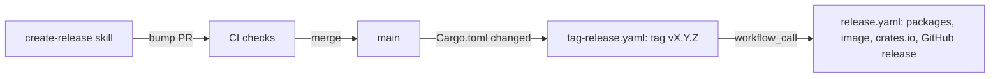

# Create release

A release is a version bump PR. Its merge does the rest through GitHub Actions:



- The skill picks the version, bumps it, writes the release notes in
  `CHANGELOG.md`, opens the PR, waits for its checks and merges it.
- `.github/workflows/tag-release.yaml` runs on main when `Cargo.toml` changes.
  It tags the merge commit with the workspace version when that tag doesn't
  exist yet, and calls `.github/workflows/release.yaml` with the tag.
- `release.yaml` builds the packages, pushes the `firebrick-base` image,
  publishes the five workspace crates to crates.io with Trusted Publishing and
  creates the GitHub release. The release notes are the version's section of
  `CHANGELOG.md`, followed by GitHub's generated list of pull requests.

The skill opens and merges the PR with the user's `gh` credentials, not in a
workflow: a PR opened with the workflow's `GITHUB_TOKEN` doesn't start the CI
checks.

## Tooling

Use `gh` and `git`. Check that `gh` is authenticated first:

```bash
gh auth status
```

If it reports unauthenticated, stop and ask the user to run `gh auth login`.

## Steps

### 1. Start from an up-to-date main

```bash
git fetch origin --tags
git status --porcelain
```

Stop when the working tree has changes: the release branch must hold only the
bump, and it starts from `origin/main`, not from the current feature branch.

### 2. Pick the version

Run the script next to this file. It finds the last `vX.Y.Z` tag on main,
ignoring pre-release tags, and applies the 0.x rules: a breaking change
(`type!:` or `BREAKING CHANGE`) or a `feat` commit bumps the minor version
(`0.3.1` to `0.4.0`); anything else bumps the patch version (`0.3.0` to
`0.3.1`).

```bash
.claude/skills/create-release/next-version.sh origin/main
```

It prints `last`, `bump`, `next` and the reason. When it exits with "nothing to
release", stop and tell the user. When the user named a version or a bump in the
request, use that instead and say so when it differs from the proposal.

### 3. Write the release notes

Start the release branch off `origin/main`:

```bash
git switch -c release/<next> origin/main
```

Collect what changed since the last tag:

```bash
git log --no-merges --format='%h %s' <last>..origin/main
gh pr list --state merged --base main --limit 100 \
  --search "merged:>=$(git log -1 --format=%cs <last>)" \
  --json number,title,body,mergedAt
```

Add a section at the top of `CHANGELOG.md`, below the intro, with this layout:

```markdown
## v0.4.0 - 2026-10-10

<one or two sentences on the theme of the release>

### Breaking changes

- <what a user must change, and how>

### Features

- <a user-visible capability, with the command or setting that enables it>
  (#123)

### Fixes

- <the bug users saw, not the code that changed> (#124)
```

- The heading must be exactly `## <next> - <today's date>`: the release workflow
  finds the notes by the tag in the heading.
- Write for users of `fbk` and `fbkd`. Leave out changes that only touch the
  agent harness (`.claude/`), CI, tests or refactors, unless they change how
  users install or run firebrick.
- Drop the subsections that would be empty. Reference the PR numbers.
- Ground every line in a commit or PR; don't invent changes.

### 4. Bump the version

```bash
.claude/skills/create-release/bump-version.sh <next without the v>
```

It updates the workspace version and the `firebrick-*` dependency versions in
`Cargo.toml`, and `Cargo.lock`. The release workflow builds with `--locked` and
checks that the tag matches the version, so both files must change.

Then update the references to the current release in `README.md`: the `VERSION=`
line of the install steps, the `fbk --version` example and the `FROM
ghcr.io/wmeints/firebrick-base:` example. Leave sentences about older releases,
such as "firebrick 0.3.0 and earlier", as they are.

Run `dprint fmt` and `cargo build`, and check the diff only touches
`Cargo.toml`, `Cargo.lock`, `CHANGELOG.md` and `README.md`.

### 5. Confirm with the user

Show the version, the reason for the bump and the `CHANGELOG.md` section, and
ask once whether to release it. A release publishes packages and an image that
can't be taken back. When the user already confirmed the version and the notes
in this conversation, go on.

### 6. Open the PR

```bash
git add Cargo.toml Cargo.lock CHANGELOG.md README.md
git commit -m "chore: release <next>"
git push -u origin release/<next>
gh pr create --base main --head release/<next> \
  --title "chore: release <next>" --body-file <body> --label risk:low
```

The body says the merge tags and releases the version, gives the reason for the
bump, and contains the `CHANGELOG.md` section. Don't hard-wrap it. Create the
`risk:low` label as the `submit-pr` skill does when it's missing. Skip the
`review-branch` workflow: the PR changes no code.

### 7. Wait for the checks and merge

The checks include the vm-tests and take longer than a foreground command may
run, so run the watch in the background and wait for its notification:

```bash
gh pr checks <number> --watch --fail-fast
```

- When a check fails, stop. Report the failing check and its log (`gh run view
  <run-id> --log-failed`) and don't merge.
- When every check passes, merge with a merge commit, as the other PRs are
  merged:

```bash
gh pr merge <number> --merge --delete-branch
```

### 8. Follow the release

The merge starts `tag-release.yaml` on main. Find its run and watch it in the
background; it waits for the packages and the image, which takes a while:

```bash
gh run list --workflow tag-release.yaml --branch main --limit 1 \
  --json databaseId,status,headSha
gh run watch <run-id> --exit-status
```

Check that the run's `headSha` is the merge commit. When the run fails, report
the failing job (`gh run view <run-id> --log-failed`). The tag exists by then,
so a second run of `tag-release.yaml` skips the release: rerun the failed jobs
with `gh run rerun <run-id> --failed` instead, after fixing the cause.

When it succeeds, verify the release and report its URL:

```bash
git fetch origin --tags
git rev-parse <next>^{commit}      # the merge commit
gh release view <next> --json url,assets,body
```

The release must have a `.tar.gz` and a `.sha256` for each target in the
deployment view (`docs/architecture/07-deployment-view.md`), and its body must
start with the `CHANGELOG.md` section. Each of the five workspace crates must
have the version on crates.io:

```bash
for crate in firebrick-proto firebrick-spec firebrick-utils firebrick-cli firebrick-daemon; do
  curl -fsS -o /dev/null -A "firebrick-release" \
    "https://crates.io/api/v1/crates/$crate/${next#v}" && echo "$crate ok"
done
```

## Guardrails

- Never push a tag or create a release by hand while `tag-release.yaml` can do
  it; a tag pushed by hand runs `release.yaml` a second time.
- Never merge a PR with failing or pending checks, and never merge with
  `--admin`.
- Release only from `main`. Pre-releases such as `v0.4.0-rc.1` are out of scope
  for this skill.
