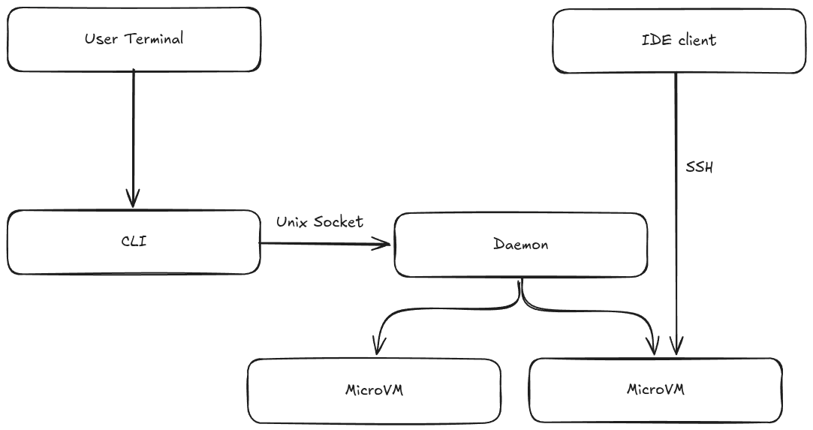

# Context and scope

The application provides a command-line interface (CLI) for the developer to
work with the application. The developer can use their favorite IDE to connect
to sandboxes using SSH.

The Daemon controls the virtual machines running in user space on the user's 
machine. We don't require root permissions ever.
