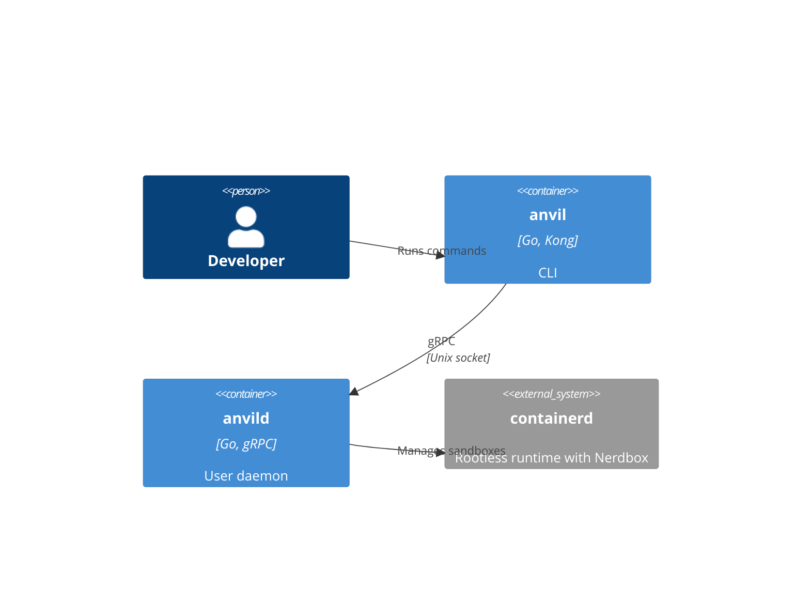
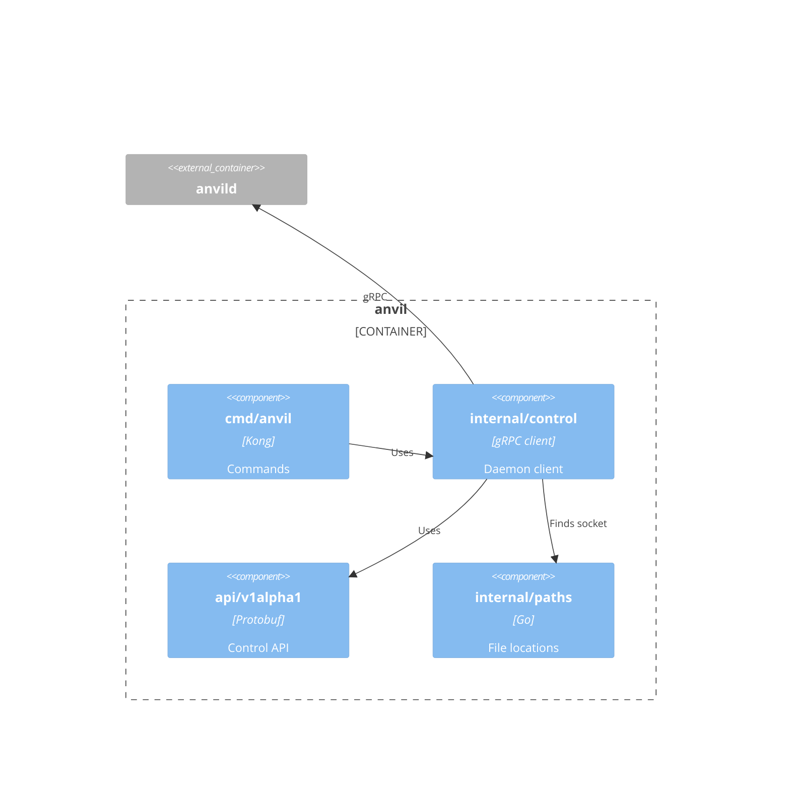
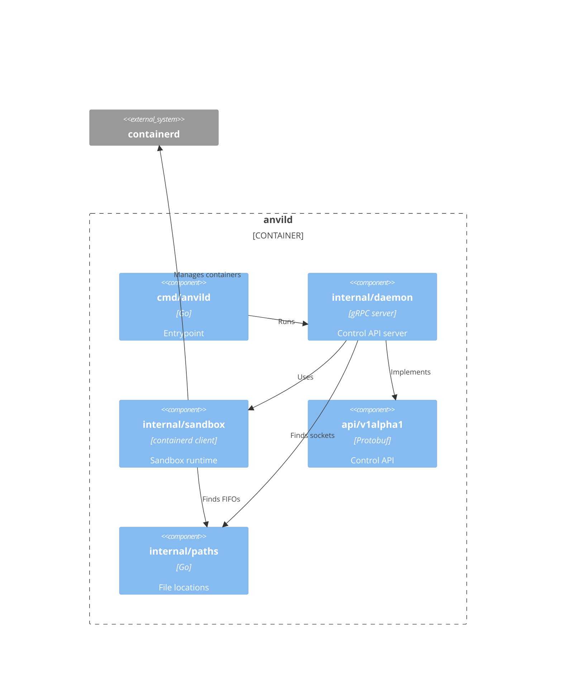

# Building block view

## Level 1 - Building blocks

- `anvil` - CLI that sends commands to the daemon and attaches the terminal to
  sandbox sessions.
- `anvild` - Daemon that manages the lifecycle of the sandboxes and sessions.

The CLI and daemon speak gRPC (`api/v1alpha1`) over a unix socket in
`$XDG_RUNTIME_DIR/anvil`. The socket directory is private to the user (`0700`).

## Level 2 - CLI

- `cmd/anvil` - Parses the `create`, `ls`, `rm` and `run` commands and puts the
  terminal in raw mode for sessions.
- `internal/control` - Client for the daemon that wraps the gRPC calls and
  streams session I/O and terminal resizes.
- `api/v1alpha1` - Protobuf definition and generated code of the control API.
- `internal/paths` - Well-known paths, such as the daemon socket.

## Level 2 - Daemon

- `cmd/anvild` - Starts the daemon.
- `internal/daemon` - Listens on the socket, connects to containerd and maps
  the control API onto sandbox operations.
- `internal/sandbox` - Creates, starts, stops and removes sandbox VMs and runs
  terminal sessions in them. Starting boots the VM of a stopped sandbox again
  on its kept disk. It derives the sandbox process from the image, see
  [crosscutting concepts](./08-crosscutting-concepts.md).
- `api/v1alpha1` - Protobuf definition and generated code of the control API.
- `internal/paths` - Well-known paths, such as the daemon socket, the
  containerd socket and the FIFO directory.

## Base image

`images/base` holds the `anvil-base` image, a base for sandbox images.
Coding agents often build and run containers, and they shouldn't work as root.
The image builds on `ubuntu:26.04` and adds:

- `agent` - an unprivileged user (UID/GID `1000`, home `/home/agent`) with
  passwordless `sudo`. The image runs as this user by default. The `ubuntu`
  user that the base image ships with UID 1000 is removed.
- Docker - Ubuntu's `docker.io` package. `agent` is in the `docker` group, and
  `dockerd` gives the socket to the `agent` group, so `agent` can use Docker
  without `sudo`. Docker stores its data in a volume at `/var/lib/docker`, so
  overlay2 doesn't sit on top of the image's own filesystem. Anvil backs the
  volume with a tmpfs.
- `anvil-entrypoint` - adds `localhost` and the hostname to `/etc/hosts` when
  they're missing, starts `dockerd` as root in the background, waits at
  most 30 seconds until it answers, and then runs the container command. When
  `dockerd` doesn't start, for example without the privileges it needs, the
  entrypoint exits with status 1 and points to `/var/log/dockerd.log`. It
  clears Docker's runtime state in `/var/run/docker` first, because stale
  pidfiles from before a stop keep `dockerd` from starting again.
- `tini` - Ubuntu's `tini` package runs as PID 1 and starts
  `anvil-entrypoint`. It forwards `SIGTERM` to the container command, so the
  container stops right away, and it reaps orphaned processes. `dockerd` gets
  no `SIGTERM`: it's killed when tini exits. Derived images that set their own
  `ENTRYPOINT` must keep `/usr/bin/tini --` in front of it.

The image sets `USER 1000` without a GID, because Docker only adds the
supplementary groups from `/etc/group`, such as `docker`, when the user has no
explicit GID. anvil can't read `/etc/passwd` or `/etc/group` without mounting
the rootfs on the host, so under anvil `agent` has no supplementary groups.
`dockerd --group agent` gives it the Docker socket anyway.

Docker writes `/etc/hosts` for a container, but anvil leaves the image's empty
file in place. Without `localhost` in it, `dockerd` waits for DNS timeouts and
takes 20 seconds to start, so the entrypoint adds the missing entries.

The `base-image` workflow builds the image for `linux/amd64` and
`linux/arm64`, and publishes it to `ghcr.io/wmeints/anvil-base` with the tags
`latest` and `sha-<short sha>` on pushes to `main`. Derived images start with
`FROM ghcr.io/wmeints/anvil-base:latest`. Run `task image:build` to build it
locally. The integration tests use the published image. To test a local build,
push it to a registry on `localhost`, which containerd reaches over plain HTTP,
and set `ANVIL_TEST_IMAGE`, for example to `localhost:5001/anvil-base:dev`.

`anvil create` uses the image by default. Custom images must declare a numeric
non-root `USER` and should build `FROM ghcr.io/wmeints/anvil-base`.
