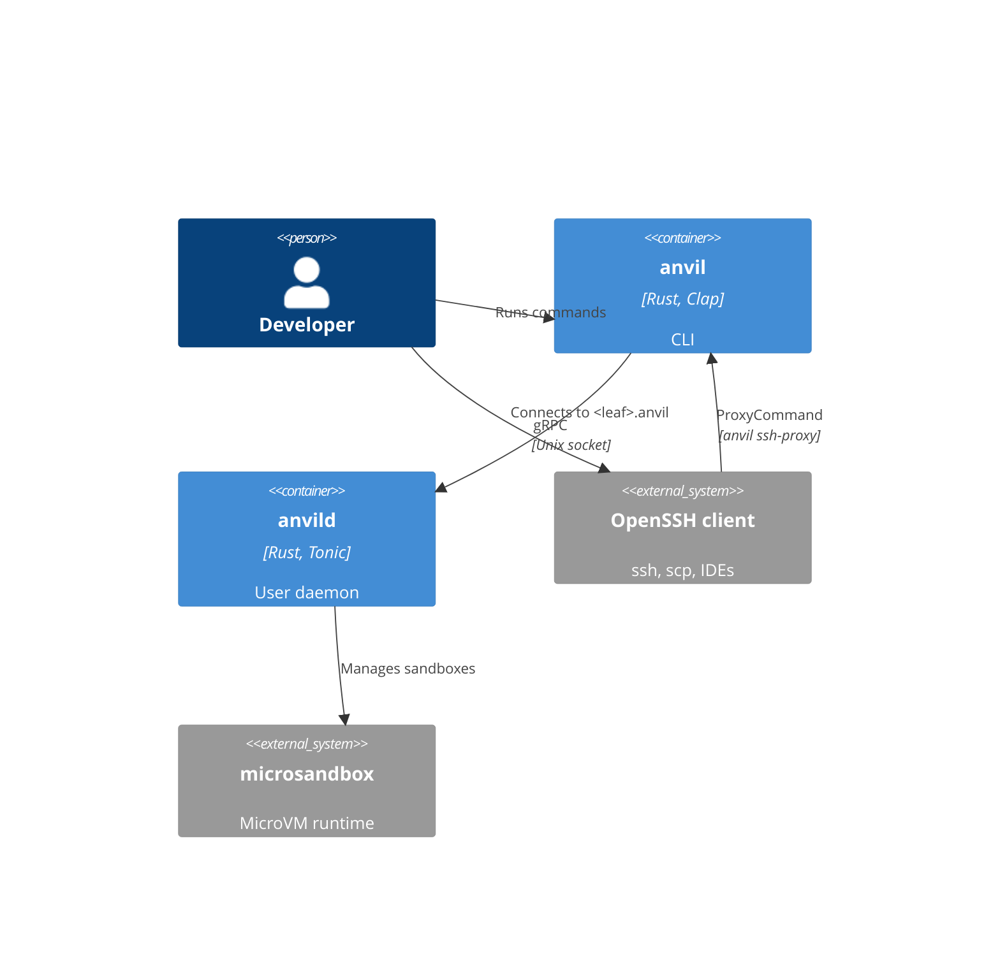
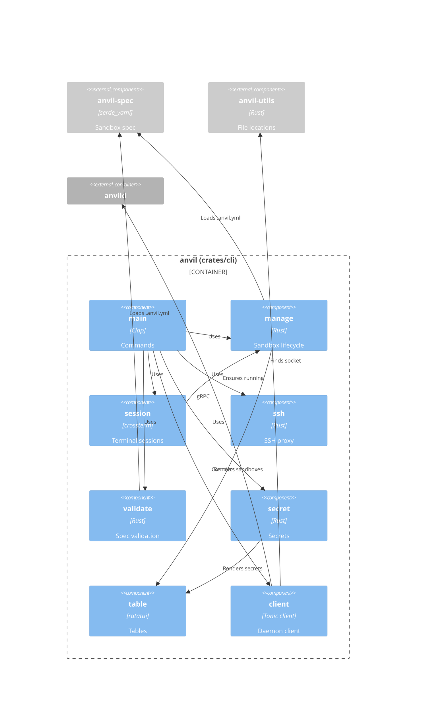
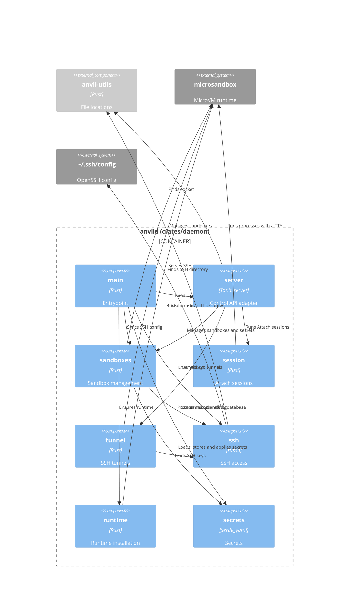

# Building block view

## Level 1 - Building blocks

- `anvil` - CLI that sends commands to the daemon, attaches the terminal to
  sandbox sessions and tunnels SSH connections to sandboxes. It starts the
  daemon when the daemon isn't running.
- `anvild` - Daemon that manages the lifecycle of the sandboxes and sessions,
  provisions the SSH keys and writes the SSH config for the sandboxes.

The CLI and daemon speak gRPC (`proto/daemon.v1.proto`) over the unix socket
`$XDG_RUNTIME_DIR/anvild.sock`. The workspace is a Cargo workspace with four
crates: `anvil-cli`, `anvil-daemon`, `anvil-spec` and `anvil-utils`. The CLI
and daemon each generate their gRPC code from the proto file in their
`build.rs`.

## Level 2 - CLI

- `main` - Parses the `start`, `stop`, `ls`, `rm`, `run`, `validate`,
  `secret set`, `secret ls` and `secret rm` commands, and the hidden `ssh-proxy` command. `validate` runs without the
  daemon.
- `client` - Connects to the daemon socket. When nobody listens, it removes a
  stale socket, spawns `anvild` from next to the `anvil` binary (or from
  `PATH`) and waits at most 5 seconds for the socket.
- `manage` - Resolves the sandbox spec for the working directory and starts,
  stops, lists and removes sandboxes. Without `.anvil.yml`, it names the
  sandbox after the full working directory path. `ls` prints the name,
  status and host name of each sandbox as a table, or as a JSON array with
  `--format json`.
- `session` - Runs a command in the sandbox through the `Attach` stream. It
  makes sure the sandbox runs first, puts the terminal in raw mode and
  forwards input, output and window resizes.
- `ssh` - Tunnels SSH protocol bytes between stdin/stdout and the
  `SshTunnel` stream. The generated SSH config uses it as `ProxyCommand`.
- `secret` - Sends a secret to the daemon with `SetSecret`. With
  `--from-stdin`, it reads the value from stdin and removes one trailing line
  ending. `secret ls` prints the names and allowed hosts from `ListSecrets`
  as a table or, with `--format json`, as a JSON array. `secret rm` removes
  a secret with `RemoveSecret`. It warns about sandboxes the daemon couldn't
  add the secret to or remove it from.
- `table` - Renders rows as a bordered table with `ratatui` into an
  in-memory buffer and returns it as plain text lines
  ([ADR 0003](decisions/0003-render-cli-tables-with-ratatui.md)).
- `validate` - Checks `.anvil.yml` and reports problems as
  `file:line:column: error: message`.

## Level 2 - Daemon

- `main` - Sets up logging to stdout and to a daily log file in
  `$XDG_STATE_HOME/anvil`, exits when the socket is already in use, makes
  sure the microsandbox runtime and the SSH keys exist, makes the
  microsandbox `db` directory readable by the user only, syncs the SSH config
  and serves the API until `SIGINT` or `SIGTERM`.
- `server` - Adapts `SandboxManagementService` to the modules below: it
  converts each request into plain values, calls `sandboxes`, `session` or
  `tunnel`, and converts the result into a response. It converts requested
  resources to vCPUs and MiB, falling back to the defaults from `anvil-spec`,
  and rejects invalid resources with `INVALID_ARGUMENT`. It
  maps the `SandboxError` of `sandboxes` to gRPC status codes in one place.
  It refuses to start when the socket already exists and removes the socket
  on shutdown.
- `sandboxes` - Manages sandboxes on top of microsandbox, without knowing
  about gRPC. It creates sandboxes from the requested image (or the default
  image) with the requested vCPUs and memory, mounts the workspace
  read/write at `/workspaces/<leaf>` and adds the stored secrets. Sandboxes
  that run the default image hand PID 1 to the image's `/sbin/init`. Invalid
  values are rejected before it creates anything. It starts, stops, gets,
  lists and removes sandboxes, gives each sandbox a unique SSH host name,
  regenerates the SSH config, and connects to a sandbox by name or host name.
  `SetSecret` stores a secret and adds it to the existing sandboxes anvil
  created. `ListSecrets` returns the names and allowed hosts, sorted by name,
  never the values. `RemoveSecret` removes a secret from the existing
  sandboxes anvil created and then from the store, keeps it in the store
  when a sandbox fails so the removal can be retried, and returns
  `NOT_FOUND` for an unknown name. A lock around the secret store makes sure
  a sandbox that is being created can't miss a secret that is being set.
- `session` - Runs an `Attach` session: rejects invalid window sizes with
  `INVALID_ARGUMENT`, starts the command with a TTY in a running sandbox and forwards input, resizes, output and the exit code
  between the gRPC stream and the process until either side ends.
- `tunnel` - Serves an `SshTunnel` connection with microsandbox's SSH server
  over an in-memory pipe, copying bytes in both directions until the SSH
  session closes. `sandboxes` boots the sandbox when needed.
- `runtime` - Makes sure the microsandbox runtime (`msb` and `libkrunfw`)
  matches the runtime archive embedded in `anvild` at build time, so it never
  needs network access. It extracts the archive when no runtime is installed,
  and replaces a runtime in the microsandbox home whose `msb` has another
  version. An explicitly configured runtime with another version, or a
  partial installation, is an error.
- `secrets` - Validates secrets, keeps them in `secrets.yml` (mode `0600`)
  and adds them to sandboxes through microsandbox's secrets feature: the
  guest sees a placeholder such as `$MSB_GH_TOKEN`, and microsandbox's TLS
  proxy puts the real value in requests to the secret's allowed hosts. It
  knows the default allowed hosts for well-known names such as `GH_TOKEN`
  and `ANTHROPIC_API_KEY` ([ADR 0004](decisions/0004-store-secrets-in-a-private-file.md)).
- `ssh` - Creates the ed25519 client and host keys, pins the host key for
  `*.anvil` in a `known_hosts` file, picks a unique `<leaf>.anvil` host name
  per sandbox (stored in the `anvil.hostname` label), and writes the
  generated SSH config that `~/.ssh/config` includes.

## Shared crates

- `anvil-spec` (`crates/spec`) - Parses `.anvil.yml` into a `SandboxSpec`
  with a `name`, an optional `image` and optional `resources` (`cpu`,
  `memory`), rejects unknown fields and reports the line and column of a
  problem. It owns the defaults (`ghcr.io/wmeints/anvil-base:v<version>`,
  2 vCPUs, `4 GiB`) and `parse_memory_mib`, which reads memory sizes in `Mi`/`MiB` or `Gi`/`GiB`.
  The CLI and daemon both use them.
- `anvil-utils` (`crates/utils`) - Well-known paths: the daemon socket
  (`$XDG_RUNTIME_DIR/anvild.sock`), the log directory
  (`$XDG_STATE_HOME/anvil`), the SSH directory
  (`$XDG_DATA_HOME/anvil/ssh`) and the secrets file
  (`$XDG_DATA_HOME/anvil/secrets.yml`).

The image and resources apply when a sandbox is created. Changing them in
`.anvil.yml` doesn't change an existing sandbox; remove it with `anvil rm`
and start it again.

## Base image

The `Dockerfile` in the repository root describes a base image for sandbox
images. It builds on `ubuntu:26.04` and adds:

- Base tooling - `ca-certificates`, `curl`, `git`, `gpg`, `procps`, `sudo` and `tini`.
- `mise` - installed from the mise apt repository. It's activated in
  `.bashrc` for interactive shells, and its shims are on `PATH` for
  everything else.
- `agent` - an unprivileged user (UID/GID `1000`, home `/home/agent`) with
  passwordless `sudo`. The image runs as this user and starts `/bin/bash` by
  default. The `ubuntu` user that the base image ships with UID 1000 is
  removed.
- `/sbin/init` - a script that disables guest IPv6 with the settings in
  `/etc/sysctl.d/99-disable-ipv6.conf` and then hands PID 1 to `tini`,
  which reaps zombie processes. `anvild` runs it as PID 1 in sandboxes that
  use the default image. See
  [ADR 0007](decisions/0007-disable-guest-ipv6-in-the-base-image.md).

The release workflow publishes the image as
`ghcr.io/wmeints/anvil-base:<tag>` (see [Deployment view](07-deployment-view.md)),
and anvil uses it as the default image. The default tag is the workspace version
with a `v` prefix, so each release of `anvil` and `anvild` runs the image from
the same release. Builds of a version that has no release yet, such as a
development build, can't pull the default image; set `image` in `.anvil.yml`
to use them.

Every sandbox image must provide an `agent` user with UID and GID `1000` and
run as it. The generated SSH config logs in as `agent`, `anvil run` runs
commands as the image's user, and the workspace is mounted with owner
`1000:1000`. See
[ADR 0006](decisions/0006-run-sandboxes-as-the-agent-user.md).
