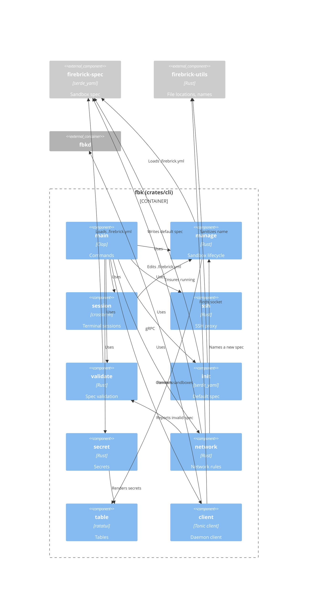
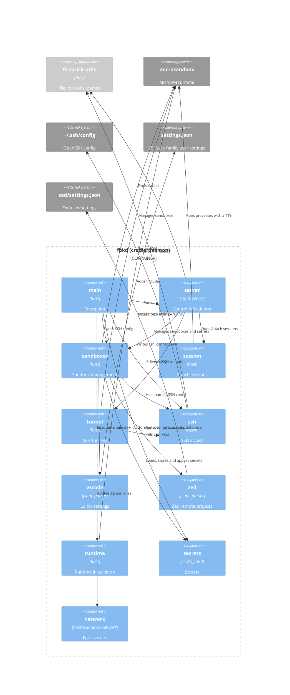

# Building block view

## Level 1 - Building blocks

- `fbk` - CLI that sends commands to the daemon, attaches the terminal to
  sandbox sessions and tunnels SSH connections to sandboxes. It starts the
  daemon when the daemon isn't running.
- `fbkd` - Daemon that manages the lifecycle of the sandboxes and sessions,
  provisions the SSH keys and writes the SSH config for the sandboxes.

The CLI and daemon speak gRPC (`crates/proto/proto/daemon.v1.proto`) over the
unix socket `$XDG_RUNTIME_DIR/fbkd.sock`. The workspace is a Cargo workspace
with five crates: `firebrick-cli`, `firebrick-daemon`, `firebrick-proto`,
`firebrick-spec` and `firebrick-utils`. The `firebrick-proto` crate generates
the gRPC client and server code from the proto file, and the CLI and daemon both
depend on it.

## Level 2 - CLI

- `main` - Parses the `start`, `stop`, `ls`, `rm`, `run`, `validate`, `init`,
  `secret set`, `secret ls`, `secret rm`, `network allow`, `network deny`,
  `network policy enable` and `network policy disable` commands, and the hidden
  `ssh-proxy` command. `validate`, `init` and `--version`, which prints the
  package version, run without the daemon.
- `client` - Connects to the daemon socket. When nobody listens, it removes a
  stale socket, spawns `fbkd` from next to the `fbk` binary (or from `PATH`) and
  waits at most 5 seconds for the socket.
- `manage` - Resolves the sandbox spec for the working directory and starts,
  stops, lists and removes sandboxes. Without `.firebrick.yml`, it names the
  sandbox after the full working directory path. `ls` prints the name, status
  and host name of each sandbox as a table, or as a JSON array with `--format
  json`.
- `session` - Runs a command in the sandbox through the `Attach` stream. It
  makes sure the sandbox runs first, puts the terminal in raw mode and forwards
  input, output and window resizes.
- `ssh` - Tunnels SSH protocol bytes between stdin/stdout and the `SshTunnel`
  stream. The generated SSH config uses it as `ProxyCommand`.
- `secret` - Sends a secret to the daemon with `SetSecret`. With `--from-stdin`,
  it reads the value from stdin and removes one trailing line ending. `secret
  ls` prints the names and allowed hosts from `ListSecrets` as a table or, with
  `--format json`, as a JSON array. `secret rm` removes a secret with
  `RemoveSecret`. It warns about sandboxes the daemon couldn't add the secret to
  or remove it from.
- `network` - Keeps the network rules in `.firebrick.yml` and the sandbox in
  sync. It validates the rules, applies the change to the network section of the
  spec in the working directory and writes the file, before it sends the whole
  section to the daemon with `UpdateNetwork`. `allow` and `deny` add rules to
  one list and remove them from the other, without duplicates. `policy` sets
  `enforce`. Without `.firebrick.yml`, it writes `default_spec` with the name
  `manage` would pick, including a legacy name, plus the change. An invalid file
  is reported like `validate` reports it, and nothing changes. When the network
  section didn't change, it leaves the file alone but still asks the daemon, so
  the sandbox catches up with the file. `NOT_FOUND` from the daemon means the
  sandbox doesn't exist yet, so the file alone is enough. It warns when `allow`
  or `deny` leave `enforce` off.
- `table` - Renders rows as a bordered table with `ratatui` into an in-memory
  buffer and returns it as plain text lines
  ([ADR 0003](decisions/0003-render-cli-tables-with-ratatui.md)).
- `validate` - Checks `.firebrick.yml` and reports problems as
  `file:line:column: error: message`.
- `init` - Writes `firebrick_spec::default_spec` as YAML to `.firebrick.yml` in
  the working directory, named after the working directory's leaf with
  `firebrick_utils::sanitize_label`, the rule that also makes the SSH host
  names. It refuses to replace an existing file unless `--force` is passed.

## Level 2 - Daemon

- `main` - Sets up logging to stdout and to a daily log file in
  `$XDG_STATE_HOME/firebrick`, exits when the socket is already in use, makes
  sure the microsandbox runtime and the SSH keys exist, makes the microsandbox
  `db` directory readable by the user only, syncs the SSH config and serves the
  API until `SIGINT` or `SIGTERM`.
- `server` - Adapts `SandboxManagementService` to the modules below: it converts
  each request into plain values, calls `sandboxes`, `session` or `tunnel`, and
  converts the result into a response. It converts requested resources and
  volumes to vCPUs and MiB, falling back to the defaults from `firebrick-spec`
  (for the Docker volume also when the request's `docker` size is empty), and
  rejects invalid values with `INVALID_ARGUMENT`. It parses the network rules of
  a `StartSandbox` or `UpdateNetwork` request with `firebrick-spec` and rejects
  an invalid rule with `INVALID_ARGUMENT`, also when the sandbox already exists.
  It maps the `SandboxError` of `sandboxes` to gRPC status codes in one place.
  It refuses to start when the socket already exists, gives the socket mode
  `0600` after binding it and removes it on shutdown. It only hands a connection
  to tonic when the peer's UID, read with `SO_PEERCRED`, is the daemon's own UID
  or root (see
  [Securing the daemon socket](08-crosscutting-concepts.md#securing-the-daemon-socket)).
- `sandboxes` - Manages sandboxes on top of microsandbox, without knowing about
  gRPC. It creates sandboxes from the requested image (or the default image)
  with the requested vCPUs and memory, mounts the workspace read/write at
  `/workspaces/<leaf>`, attaches a sandbox-owned ext4 disk of the requested size
  at `/var/lib/docker` (see
  [ADR 0015](decisions/0015-give-each-sandbox-a-docker-data-disk.md)), applies
  the egress rules with the `network` module and adds the stored secrets. The
  disk survives stops and restarts, and microsandbox deletes it when the sandbox
  is removed. With `init` on, it hands PID 1 to the image's `/sbin/init`. When
  that fails because the image has no init, it removes the half-created sandbox
  and returns `FAILED_PRECONDITION` with a hint to set `init: false`. Invalid
  values are rejected before it creates anything. When it creates or starts a
  sandbox, it uses the `mise` module to trust the mise config files at the
  workspace root and run `mise install`, unless the sandbox's `firebrick.mise`
  label, stored at create time, turns mise off (see
  [Starting a sandbox](06-runtime-view.md#starting-a-sandbox)). It starts,
  stops, gets, lists and removes sandboxes, gives each sandbox a unique SSH host
  name, regenerates the SSH config, the editor settings and Zed's remote
  projects after every start and remove and when the daemon starts, and connects
  to a sandbox by name or host name. `GetSandbox` returns the sandbox's working
  directory, which is the workspace mount path, as `workspace_path`, and the
  host directory bind-mounted there, canonicalized, as `workspace_host_path`.
  Both are empty for a sandbox without a workspace. The CLI compares
  `workspace_host_path` with the working directory before it uses an existing
  sandbox. A failed sync only logs a warning. `SetSecret` stores a secret and
  adds it to the existing sandboxes firebrick created. `ListSecrets` returns the
  names and allowed hosts, sorted by name, never the values. `RemoveSecret`
  removes a secret from the existing sandboxes firebrick created and then from
  the store, keeps it in the store when a sandbox fails so the removal can be
  retried, and returns `NOT_FOUND` for an unknown name. A lock around the secret
  store makes sure a sandbox that is being created can't miss a secret that is
  being set. `UpdateNetwork` replaces the egress rules of an existing sandbox by
  recreating it from a disk snapshot, with the settings it reads from the
  sandbox's stored config (see
  [Updating the network rules](06-runtime-view.md#updating-the-network-rules)
  and
  [ADR 0019](decisions/0019-recreate-sandboxes-from-a-disk-snapshot-to-change-their-network-rules.md)).
  It skips a sandbox whose `firebrick.network` label already records the rules
  and refuses a paused one. Creating and recreating a sandbox share one builder
  chain, which also sets that label. A lock per sandbox name, held by start,
  stop, remove, connect and `UpdateNetwork`, keeps those operations from
  interleaving with a recreate; a lock is dropped when no task holds or waits
  for it.
- `session` - Runs an `Attach` session: rejects invalid window sizes with
  `INVALID_ARGUMENT`, starts the command with a TTY in a running sandbox and
  forwards input, resizes, output and the exit code between the gRPC stream and
  the process until either side ends.
- `tunnel` - Serves an `SshTunnel` connection with microsandbox's SSH server
  over an in-memory pipe, copying bytes in both directions until the SSH session
  closes. `sandboxes` boots the sandbox when needed.
- `runtime` - Makes sure the microsandbox runtime (`msb` and `libkrunfw`)
  matches the runtime archive embedded in `fbkd` at build time, so it never
  needs network access. It extracts the archive when no runtime is installed,
  and replaces a runtime in the microsandbox home whose `msb` has another
  version. An explicitly configured runtime with another version, or a partial
  installation, is an error.
- `secrets` - Validates secrets, keeps them in `secrets.yml` (mode `0600`) and
  adds them to sandboxes through microsandbox's secrets feature: the guest sees
  a placeholder such as `$MSB_GH_TOKEN`, and microsandbox's TLS proxy puts the
  real value in requests to the secret's allowed hosts. It knows the default
  allowed hosts for well-known names such as `GH_TOKEN` and `ANTHROPIC_API_KEY`
  ([ADR 0004](decisions/0004-store-secrets-in-a-private-file.md)).
- `network` - Turns the `network` section of a spec into the network settings of
  a sandbox that is being created. Without `enforce`, it leaves the sandbox with
  microsandbox's default policy. With `enforce`, it builds a policy of all deny
  rules, then all allow rules, then microsandbox's DNS rule, with deny as the
  default for egress. Host names map to a `Domain`, `*.domain` to a
  `DomainSuffix`, and IP addresses and CIDR ranges to a `Cidr`. It also turns on
  TLS interception for port 443 and microsandbox's HTTP deny response, whose
  body names the host and `fbk network allow <host>`
  ([ADR 0018](decisions/0018-enforce-egress-with-microsandboxs-network-policy.md)).
- `ssh` - Creates the ed25519 client and host keys, pins the host key for
  `*.fbk` in a `known_hosts` file, picks a unique `<leaf>.fbk` host name per
  sandbox (stored in the `firebrick.hostname` label, with the leaf sanitized by
  `firebrick_utils::sanitize_label`), and writes the generated SSH config that
  `~/.ssh/config` includes.
- `vscode` - Keeps `remote.SSH.remotePlatform` in the user `settings.json` of VS
  Code, VS Code Insiders, Cursor and VSCodium in sync with the sandbox host
  names, so Remote-SSH doesn't ask for the platform. Every host maps to
  `"linux"` and stale `*.fbk` keys are removed; other keys, comments and
  trailing commas stay as they are
  ([ADR 0010](decisions/0010-edit-vs-code-settings-with-jsonc-parser.md)). The
  settings live under `$XDG_CONFIG_HOME` (default `~/.config`) on Linux and
  `~/Library/Application Support` on macOS; `FIREBRICK_EDITOR_CONFIG_ROOT`
  overrides both, which the `vm-tests` use to stay away from the developer's own
  settings. An editor whose `User` directory doesn't exist is skipped, and a
  missing `settings.json` is created. A file is left unchanged with a warning
  when it isn't JSON with comments and trailing commas (what VS Code accepts),
  when `remote.SSH.remotePlatform` isn't an object or appears more than once, or
  when it's a symlink to a missing file. Writes go to a temporary file that is
  renamed onto the file a symlink points to, so a symlinked settings file stays
  a symlink. The reading, writing and parse options live in `settings_file`,
  which `zed` shares.
- `zed` - Keeps the `ssh_connections` array in Zed's user `settings.json` in
  sync with the sandboxes, so they show up in Zed's Remote Projects. Each
  sandbox with a host name gets an entry with `host`, the sandbox name as
  `nickname`, and one project whose `paths` hold the workspace path (no projects
  for a sandbox without one). The daemon owns the entries whose `host` ends in
  `.fbk`: it adds missing ones, rewrites the ones whose value differs and
  removes stale and duplicate ones; other entries, keys, comments and trailing
  commas stay as they are
  ([ADR 0011](decisions/0011-own-the-anvil-entries-in-zeds-ssh-connections.md)).
  The file is `zed/settings.json` under `$XDG_CONFIG_HOME` (default `~/.config`)
  on Linux and under `~/.config` on macOS, the same as Zed's own config
  directory; `FIREBRICK_EDITOR_CONFIG_ROOT` overrides both. When the `zed`
  directory doesn't exist, Zed is skipped; a missing `settings.json` is created.
  The file is left unchanged with a warning when it can't be parsed, when
  `ssh_connections` isn't an array, appears more than once or has an entry that
  isn't an object, or when it can't be read or written.

## Shared crates

- `firebrick-proto` (`crates/proto`) - The gRPC client and server code that
  `tonic-prost-build` generates from `crates/proto/proto/daemon.v1.proto`. The
  CLI and daemon re-export it as their `api` module.
- `firebrick-spec` (`crates/spec`) - Parses `.firebrick.yml` into a
  `SandboxSpec` with a `name`, an optional `image`, optional `init` and `mise`
  flags, optional `resources` (`cpu`, `memory`), `volumes` (`docker`, the size
  of the Docker data disk) and an optional `network` section (`enforce`, default
  `false`, and the `allow` and `deny` rules), rejects unknown fields and reports
  the line and column of a problem. `NetworkRule` parses a rule: a host name,
  `*.` plus a domain of at least two labels, an IPv4 or IPv6 address or a CIDR
  range. `*` alone, other wildcards, URLs, ports and paths are invalid. It owns
  the defaults (`ghcr.io/wmeints/firebrick-base:v<version>`, `init: true`,
  `mise: true`, 2 vCPUs, `4 GiB` of memory, a `20 GiB` Docker volume in
  `VolumesSpec::default()`) and `parse_size_mib`, which reads memory and volume
  sizes in `Mi`/`MiB` or `Gi`/`GiB`. The CLI and daemon both use them.
  `NetworkSpec::allow` and `NetworkSpec::deny` move rules between the lists, and
  `to_file` writes a spec back as YAML, leaving out unset fields.
- `firebrick-utils` (`crates/utils`) - Well-known paths: the daemon socket
  (`$XDG_RUNTIME_DIR/fbkd.sock`), the log directory
  (`$XDG_STATE_HOME/firebrick`), the SSH directory
  (`$XDG_DATA_HOME/firebrick/ssh`) and the secrets file
  (`$XDG_DATA_HOME/firebrick/secrets.yml`). It also holds `sanitize_label`,
  which turns a directory's leaf into a lowercase DNS label (or `sandbox` when
  nothing is left), so the SSH host names and the name `fbk init` writes match.

The image, init, mise setting, resources and network rules apply when a sandbox
is created. Changing them in `.firebrick.yml` doesn't change an existing
sandbox; remove it with `fbk rm` and start it again. The network rules are the
exception: `fbk network` changes them in `.firebrick.yml` and has `fbkd`
recreate the sandbox from a disk snapshot, which keeps its disks.

## Base image

The `Dockerfile` in the repository root describes a base image for sandbox
images. It builds on `ubuntu:26.04` and adds:

- Base tooling - `build-essential`, `ca-certificates`, `curl`, `git`, `gpg`,
  `libssl-dev`, `pkg-config`, `procps`, `sudo` and `tini`. The build toolchain
  and OpenSSL headers let native npm and pip extensions, Rust crates with C
  build scripts such as `openssl-sys`, and runtimes that mise builds from source
  compile without installing anything first.
- `mise` - installed from the mise apt repository. It's activated in `.bashrc`
  for interactive shells, and its shims are on `PATH` for everything else.
- Docker - `docker-ce`, `docker-ce-cli`, `containerd.io`, `docker-buildx-plugin`
  and `docker-compose-plugin` from Docker's apt repository. `dockerd` runs
  directly on the sandbox VM and keeps its data on the ext4 disk that `fbkd`
  attaches at `/var/lib/docker`. See
  [ADR 0016](decisions/0016-run-docker-in-the-sandbox-vm.md).
- `agent` - an unprivileged user (UID/GID `1000`, home `/home/agent`) with
  passwordless `sudo`, in the `docker` group so it can run `docker` without
  `sudo`. The image runs as this user and starts `/bin/bash` by default. The
  `ubuntu` user that the base image ships with UID 1000 is removed.
- `/sbin/init` - a script that disables guest IPv6 with the settings in
  `/etc/sysctl.d/99-disable-ipv6.conf`, removes Docker's runtime state from the
  previous boot, which survives in `/run` because it sits on the persistent
  root, starts `dockerd` in the background with its output in
  `/var/log/dockerd.log`, and then hands PID 1 to `tini`, which reaps zombie
  processes. It doesn't wait for `dockerd` to be ready, and the sandbox boots
  even when `dockerd` fails. `fbkd` runs it as PID 1 unless the spec sets `init:
  false`; then nothing starts `dockerd`, and the agent can start it in the
  background with `sudo sh -c 'dockerd >/var/log/dockerd.log 2>&1 &'`. See
  [ADR 0007](decisions/0007-disable-guest-ipv6-in-the-base-image.md).

The release workflow publishes the image as
`ghcr.io/wmeints/firebrick-base:<tag>` (see
[Deployment view](07-deployment-view.md)), and firebrick uses it as the default
image. The default tag is the workspace version with a `v` prefix, so each
release of `fbk` and `fbkd` runs the image from the same release. Builds of a
version that has no release yet, such as a development build, can't pull the
default image; set `image` in `.firebrick.yml` to use them.

Every sandbox image must provide an `agent` user with UID and GID `1000` and run
as it. The generated SSH config logs in as `agent`, `fbk run` runs commands as
the image's user, and the workspace is mounted with owner `1000:1000`. See
[ADR 0006](decisions/0006-run-sandboxes-as-the-agent-user.md).
