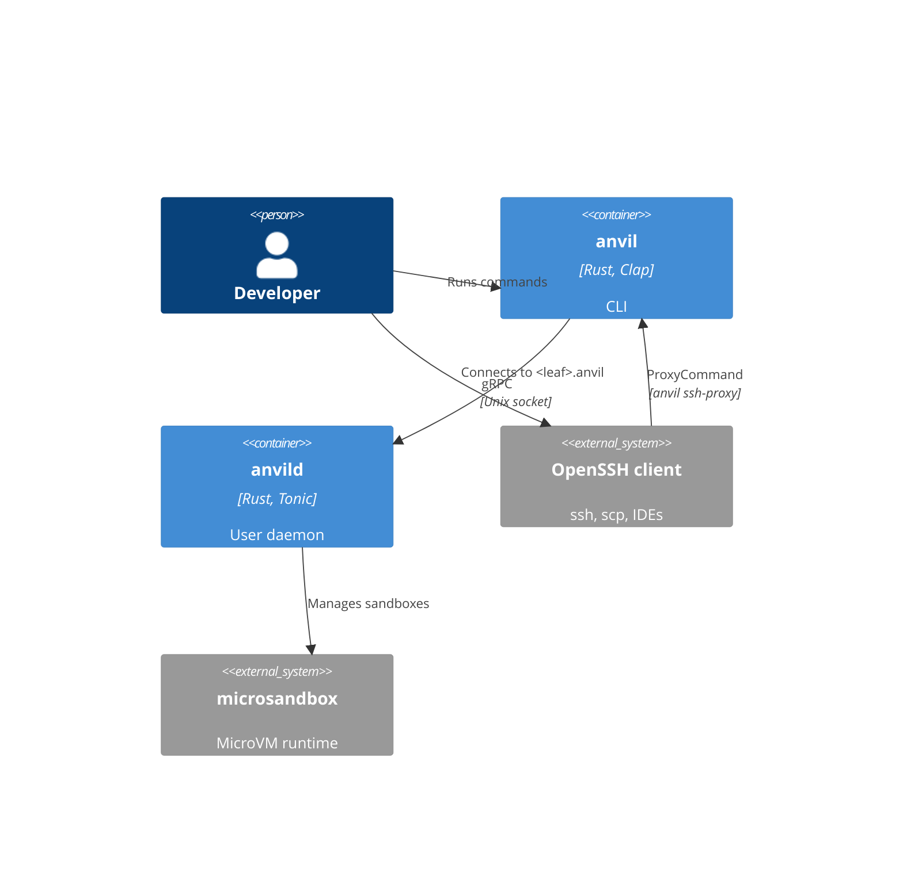
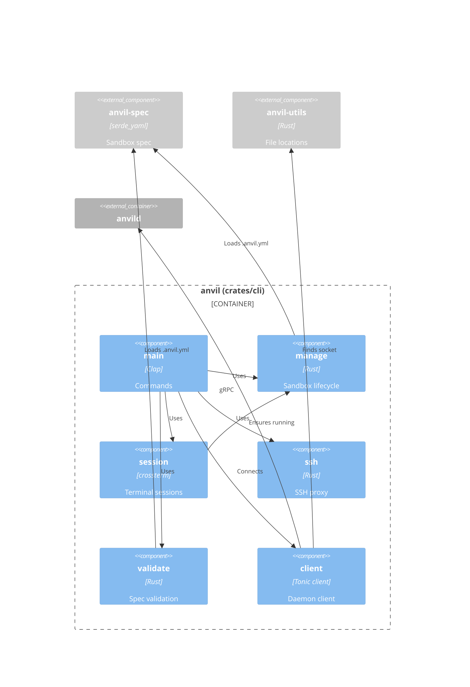
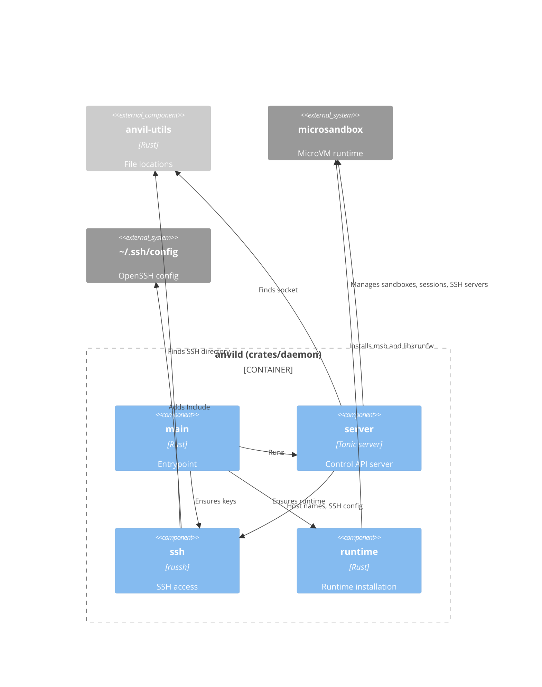

# Building block view

## Level 1 - Building blocks

- `anvil` - CLI that sends commands to the daemon, attaches the terminal to
  sandbox sessions and tunnels SSH connections to sandboxes. It starts the
  daemon when the daemon isn't running.
- `anvild` - Daemon that manages the lifecycle of the sandboxes and sessions,
  provisions the SSH keys and writes the SSH config for the sandboxes.

The CLI and daemon speak gRPC (`proto/daemon.v1.proto`) over the unix socket
`$XDG_RUNTIME_DIR/anvild.sock`. The workspace is a Cargo workspace with four
crates: `anvil-cli`, `anvil-daemon`, `anvil-spec` and `anvil-utils`. The CLI
and daemon each generate their gRPC code from the proto file in their
`build.rs`.

## Level 2 - CLI

- `main` - Parses the `start`, `stop`, `ls`, `rm`, `run` and `validate`
  commands, and the hidden `ssh-proxy` command. `validate` runs without the
  daemon.
- `client` - Connects to the daemon socket. When nobody listens, it removes a
  stale socket, spawns `anvild` from next to the `anvil` binary (or from
  `PATH`) and waits at most 5 seconds for the socket.
- `manage` - Resolves the sandbox spec for the working directory and starts,
  stops, lists and removes sandboxes. Without `.anvil.yml`, it names the
  sandbox after the full working directory path. `ls` prints the name,
  status and host name of each sandbox as a table rendered with `ratatui`,
  or as a JSON array with `--format json`.
- `session` - Runs a command in the sandbox through the `Attach` stream. It
  makes sure the sandbox runs first, puts the terminal in raw mode and
  forwards input, output and window resizes.
- `ssh` - Tunnels SSH protocol bytes between stdin/stdout and the
  `SshTunnel` stream. The generated SSH config uses it as `ProxyCommand`.
- `validate` - Checks `.anvil.yml` and reports problems as
  `file:line:column: error: message`.

## Level 2 - Daemon

- `main` - Sets up logging to stdout and to a daily log file in
  `$XDG_STATE_HOME/anvil`, exits when the socket is already in use, makes
  sure the microsandbox runtime and the SSH keys exist, syncs the SSH config
  and serves the API until `SIGINT` or `SIGTERM`.
- `server` - Implements `SandboxManagementService` on top of microsandbox.
  It creates sandboxes from the requested image with the requested vCPUs and
  memory, and mounts the workspace read/write at `/workspaces/<leaf>`. It
  falls back to the defaults from `anvil-spec` when the request has no image
  or resources, and rejects invalid resources with `INVALID_ARGUMENT` before
  it creates anything. It starts, stops, lists and removes sandboxes. It runs `Attach` sessions with a TTY, and serves `SshTunnel`
  connections with microsandbox's SSH server over an in-memory pipe, booting
  the sandbox when needed. It refuses to start when the socket already exists
  and removes the socket on shutdown.
- `runtime` - Makes sure the microsandbox runtime (`msb` and `libkrunfw`)
  matches the runtime archive embedded in `anvild` at build time, so it never
  needs network access. It extracts the archive when no runtime is installed,
  and replaces a runtime in the microsandbox home whose `msb` has another
  version. An explicitly configured runtime with another version, or a
  partial installation, is an error.
- `ssh` - Creates the ed25519 client and host keys, pins the host key for
  `*.anvil` in a `known_hosts` file, picks a unique `<leaf>.anvil` host name
  per sandbox (stored in the `anvil.hostname` label), and writes the
  generated SSH config that `~/.ssh/config` includes.

## Shared crates

- `anvil-spec` (`crates/spec`) - Parses `.anvil.yml` into a `SandboxSpec`
  with a `name`, an optional `image` and optional `resources` (`cpu`,
  `memory`), rejects unknown fields and reports the line and column of a
  problem. It owns the defaults (`ubuntu:26.04`, 2 vCPUs, `4 GiB`) and
  `parse_memory_mib`, which reads memory sizes in `Mi`/`MiB` or `Gi`/`GiB`.
  The CLI and daemon both use them.
- `anvil-utils` (`crates/utils`) - Well-known paths: the daemon socket
  (`$XDG_RUNTIME_DIR/anvild.sock`), the log directory
  (`$XDG_STATE_HOME/anvil`) and the SSH directory
  (`$XDG_DATA_HOME/anvil/ssh`).

The image and resources apply when a sandbox is created. Changing them in
`.anvil.yml` doesn't change an existing sandbox; remove it with `anvil rm`
and start it again.

## Base image

The `Dockerfile` in the repository root describes a base image for sandbox
images. It builds on `ubuntu:26.04` and adds:

- Base tooling - `ca-certificates`, `curl`, `git`, `gpg` and `sudo`.
- `mise` - installed from the mise apt repository. It's activated in
  `.bashrc` for interactive shells, and its shims are on `PATH` for
  everything else.
- `agent` - an unprivileged user (UID/GID `1000`, home `/home/agent`) with
  passwordless `sudo`. The image runs as this user and starts `/bin/bash` by
  default. The `ubuntu` user that the base image ships with UID 1000 is
  removed.

The release workflow publishes the image as
`ghcr.io/wmeints/anvil-base:<tag>` (see [Deployment view](07-deployment-view.md)),
but anvil doesn't use it by default: the default image is `ubuntu:26.04`, and
SSH logs in as `root`.
