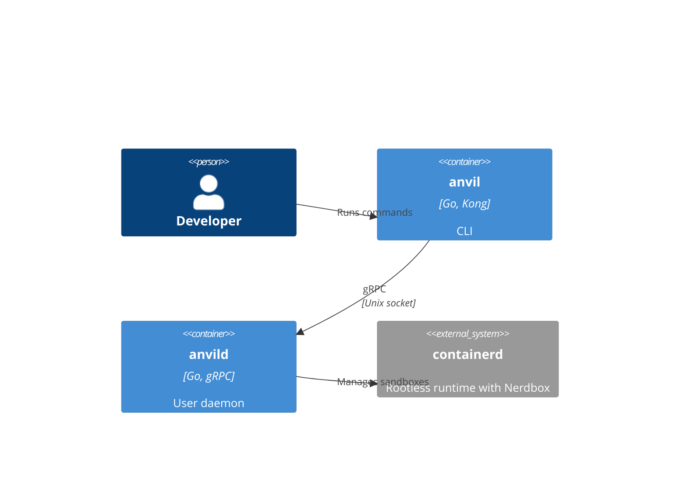
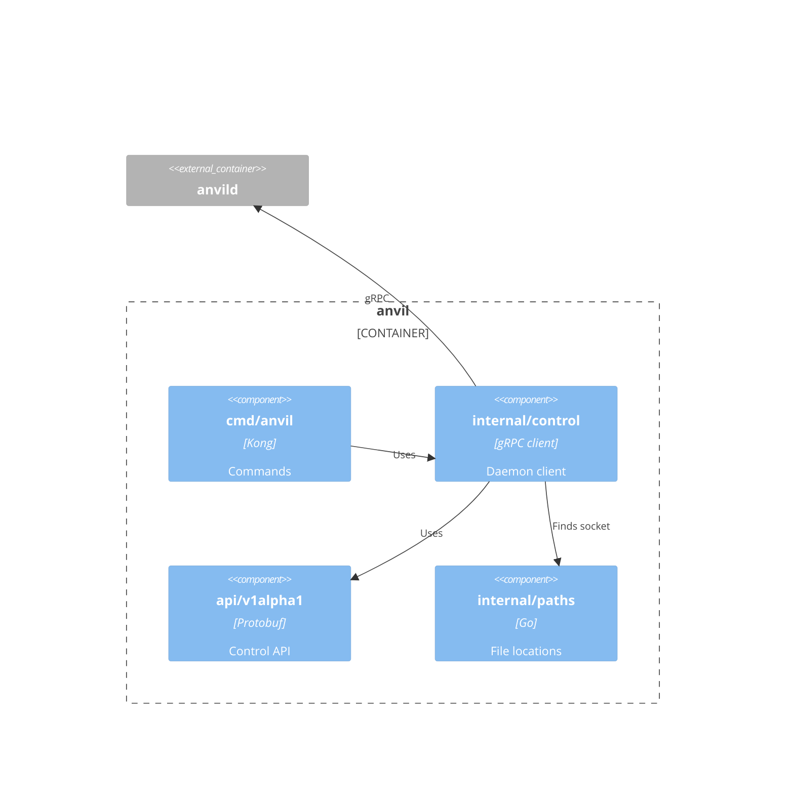
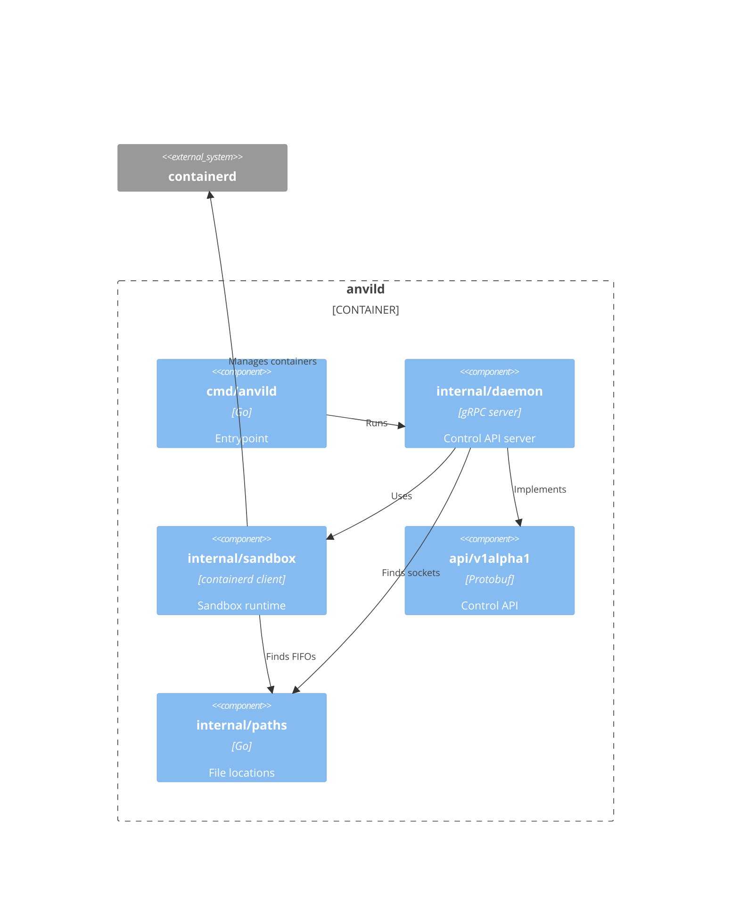

# Building block view

## Level 1 - Building blocks

- `anvil` - CLI that sends commands to the daemon and attaches the terminal to
  sandbox sessions.
- `anvild` - Daemon that manages the lifecycle of the sandboxes and sessions.

The CLI and daemon speak gRPC (`api/v1alpha1`) over a unix socket in
`$XDG_RUNTIME_DIR/anvil`. The socket directory is private to the user (`0700`).

## Level 2 - CLI

- `cmd/anvil` - Parses the `create`, `ls`, `rm` and `run` commands and puts the
  terminal in raw mode for sessions.
- `internal/control` - Client for the daemon that wraps the gRPC calls and
  streams session I/O and terminal resizes.
- `api/v1alpha1` - Protobuf definition and generated code of the control API.
- `internal/paths` - Well-known paths, such as the daemon socket.

## Level 2 - Daemon

- `cmd/anvild` - Starts the daemon.
- `internal/daemon` - Listens on the socket, connects to containerd and maps
  the control API onto sandbox operations.
- `internal/sandbox` - Creates, starts, stops and removes sandbox VMs and runs
  terminal sessions in them.
- `api/v1alpha1` - Protobuf definition and generated code of the control API.
- `internal/paths` - Well-known paths, such as the daemon socket, the
  containerd socket and the FIFO directory.
