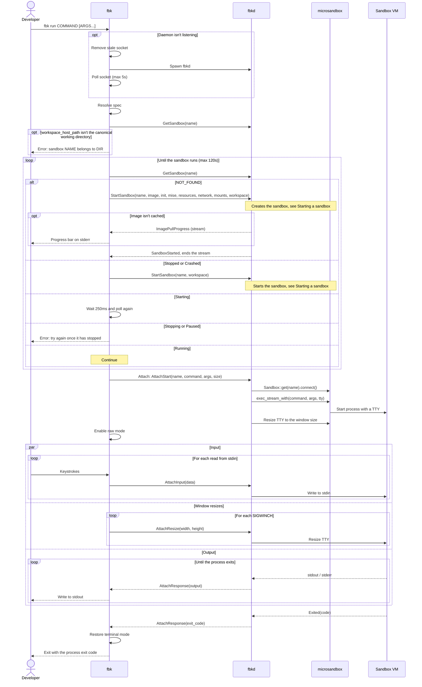
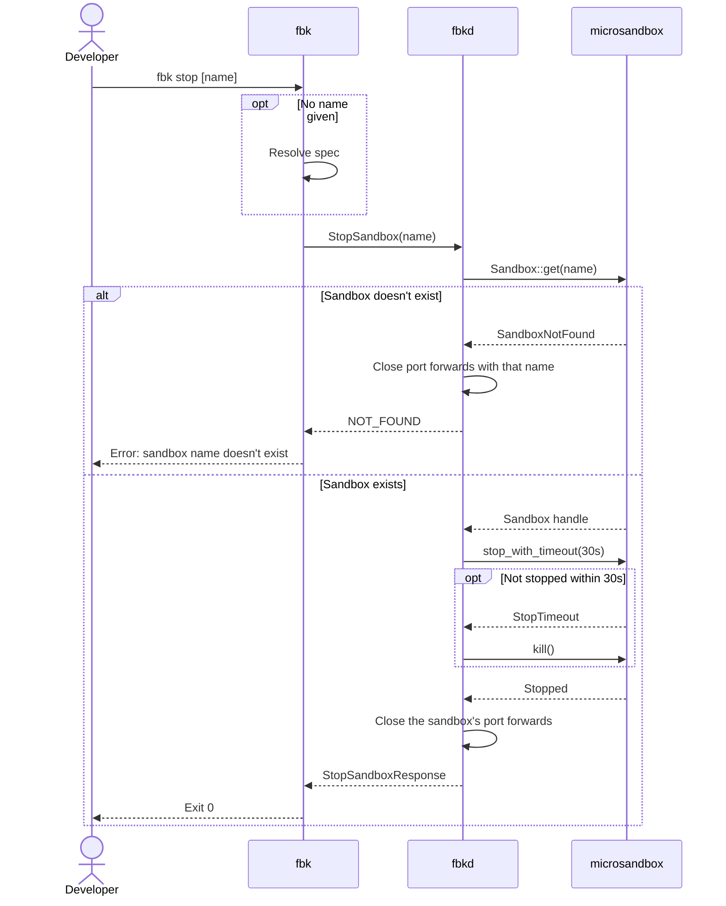
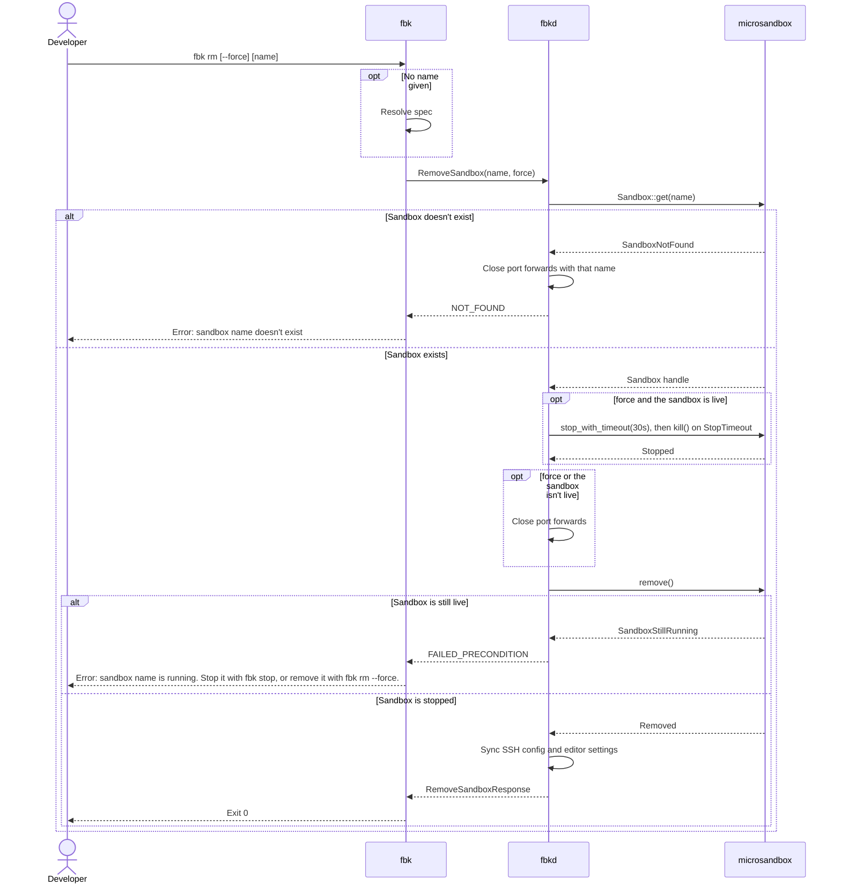
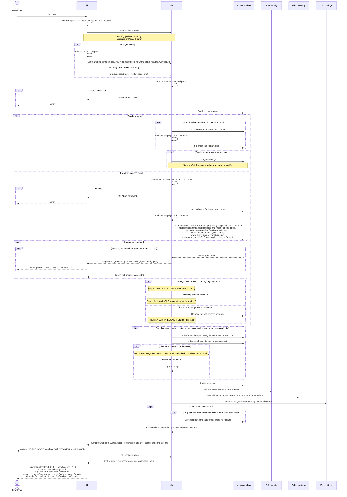
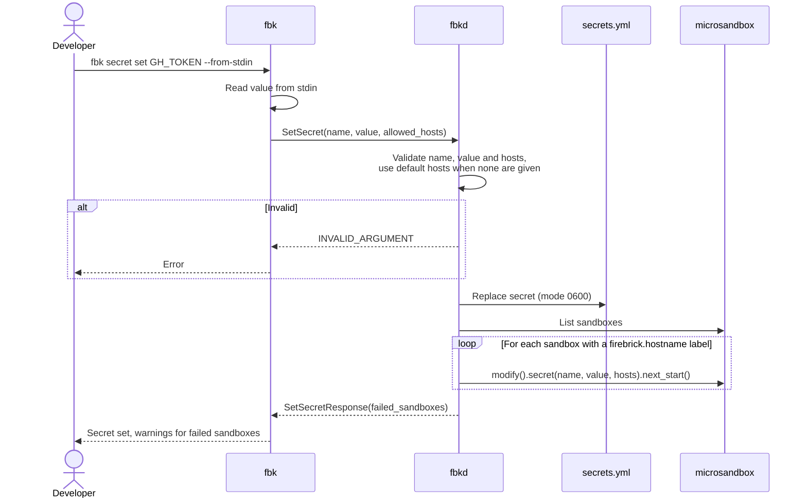
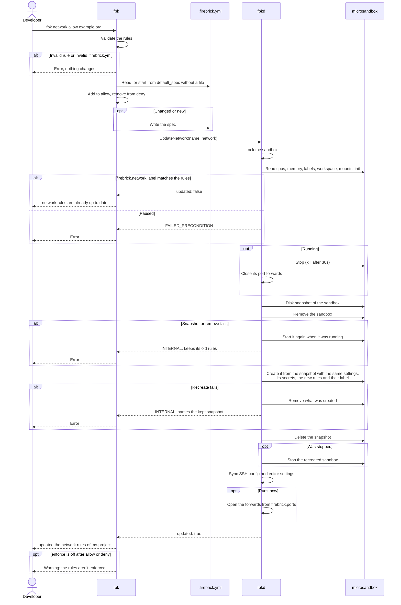
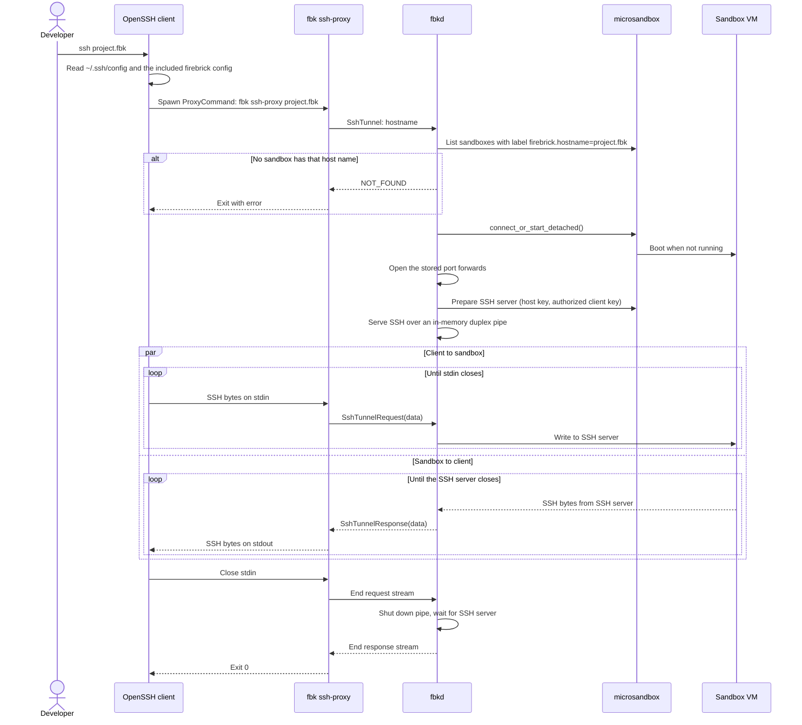

# Runtime view

Every command except `validate` starts by connecting to the daemon over
`$XDG_RUNTIME_DIR/fbkd.sock`. When nobody listens on the socket, the CLI removes
a stale socket file, spawns `fbkd` and polls the socket for at most 5 seconds.
The diagrams below show this step once, in
[Running a session](#running-a-session), and leave it out of the others.

Before `fbkd` listens, it exits when the socket already exists, and then makes
sure the microsandbox runtime matches the runtime embedded in its binary. It
extracts the embedded runtime when the runtime is missing or has another
version. When `MSB_PATH` or `paths.msb` selects a runtime with another version,
`fbkd` exits instead, and the CLI reports a timeout.

The CLI resolves the sandbox name from `.firebrick.yml` in the working
directory. Without a spec file, it first asks the daemon for a sandbox with the
name older versions derived from the path, such as `home_user_my_project`, and
keeps using it when it exists. Otherwise it names the sandbox `firebrick-`
followed by the first 6 hex digits of the SHA-256 hash of the full working
directory path, such as `firebrick-d9f287`.

Before `fbk start` without a name, or `fbk run`, uses an existing sandbox, the
CLI checks that the sandbox belongs to the working directory. `GetSandbox`
returns the host directory the sandbox bind-mounts as its workspace in
`workspace_host_path`, which microsandbox stores canonicalized. The CLI compares
it with the canonicalized working directory, whether the sandbox is running,
starting or stopped. When they differ, for example because two paths share a
hashed name, the command fails without starting or attaching:

```text
Error: sandbox firebrick-d9f287 belongs to /home/user/my-project; add a .firebrick.yml with its own name to give this directory a separate sandbox
```

A sandbox without a workspace mount, such as one created outside `fbk`, isn't
checked. `fbk start <name>`, `fbk stop` and `fbk rm` don't check either. The
check lives in the CLI rather than in `StartSandbox`, because the CLI never
calls `StartSandbox` for a sandbox that already runs.

## Running a session

`fbk run <command> [args...]` makes sure the sandbox runs, then attaches the
local terminal to a command in the sandbox through the bidirectional `Attach`
stream.



When the CLI disconnects before the process exits, the daemon kills the process.
The sandbox keeps running after the session ends.

The daemon runs every session with `TERM=xterm-256color`. Without it,
microsandbox passes on the daemon's own `TERM`, such as `xterm-ghostty`, which
the guest may have no terminfo entry for, so programs like `clear` fail.

## Stopping a sandbox

`fbk stop` stops the sandbox for the working directory. The sandbox and its disk
stay, so it can be started again later. `fbk stop <name>` stops the sandbox with
that name, as listed by `fbk ls`, from any directory: the CLI uses the name as
is and doesn't read `.firebrick.yml`.

`fbkd` asks the guest to shut down and gives it 30 seconds (`STOP_TIMEOUT` in
`crates/daemon/src/sandboxes.rs`). When the sandbox hasn't stopped by then,
`fbkd` kills it, so a guest that ignores the shutdown can't make `fbk stop`
hang. A killed sandbox can lose writes the guest hadn't flushed to its disk yet.
Once the sandbox has stopped, `fbkd` closes its port forwards, so their host
ports are free when `fbk stop` returns. When stopping fails, the forwards stay
open, because the sandbox may still run. When the sandbox doesn't exist anymore,
for example because it was removed with `msb rm`, `fbkd` still closes the
forwards it has open for that name, for `fbk stop` and `fbk rm`.



## Removing a sandbox

`fbk rm [name]` resolves the name like `fbk stop` and sends `RemoveSandbox`.
microsandbox refuses to remove a sandbox that is starting, running, draining or
paused, so `fbkd` turns that refusal into `FAILED_PRECONDITION` and the CLI
explains how to remove the sandbox. With `fbk rm --force`, the request carries
`force: true` and `fbkd` first stops a live sandbox the same way as `fbk stop`,
killing it after 30 seconds. When that stop fails, `fbkd` returns `INTERNAL` and
leaves the sandbox in place. A stopped or crashed sandbox is removed with or
without `--force`. `fbkd` closes the sandbox's port forwards once the sandbox
isn't live anymore, before it removes it, so they also close when the removal
fails. After a removal, `fbkd` syncs the SSH config and the editors' Remote-SSH
settings, so they drop the sandbox's host.



## Starting a sandbox

`fbk start` creates the sandbox when it doesn't exist yet, or starts the
existing one. The image, init, mise setting, resources, network rules and mounts
from the spec only apply when the sandbox is created; the `ports` apply every
time. Like `fbk run`, the CLI first checks the status of the sandbox: it waits
for a starting one (max 120s), fails for a stopping or paused one, and sends
`StartSandbox` with the spec's ports for a running, stopped or crashed one. The
daemon's `StartSandbox` is idempotent as well: it returns without starting a
sandbox that is already running or starting, and treats a start that loses a
race with another start as a success.

The daemon parses the `network` rules of every `StartSandbox` and rejects an
invalid one with `INVALID_ARGUMENT` before it looks up the sandbox. When it
creates a sandbox with `enforce: true`, it gives the sandbox a network policy
that checks every outgoing connection in this order: the deny rules, the allow
rules, then DNS to the sandbox's resolver, and denies the rest. microsandbox
matches domain rules against DNS queries too, so a host denied by a domain rule
doesn't resolve. TLS interception is on for port 443, so an HTTP or HTTPS
request to a host that no rule matched gets `403 Forbidden` with `firebrick
blocked the connection to <host>: ...`, as long as the policy has no domain deny
rule; see [Risks and technical debt](11-risks-and-technical-debt.md) for the
limits. Without enforcement the sandbox gets microsandbox's default policy
([ADR 0018](decisions/0018-enforce-egress-with-microsandboxs-network-policy.md)).
With enforcement on, `mise install` only reaches the hosts the rules allow.

Before the CLI creates a sandbox, it resolves the `host` of each entry in
`mounts` against the directory of `.firebrick.yml`, expanding `~` to `$HOME` and
`~user` to that user's home directory, and canonicalizes it. It fails with
`can't mount <path>: No such file or directory` or `can't mount <path>: not a
directory` without calling the daemon. The daemon rejects a mount whose guest
path equals the workspace path with `INVALID_ARGUMENT` before it creates
anything, and otherwise bind mounts each directory like the workspace: owned by
`1000:1000`, with host permissions mirrored, and read-only when `readonly` is
set. Starting an existing sandbox sends no mounts.

`StartSandbox` is a server-streaming RPC. When fbkd creates a sandbox whose
image isn't cached, microsandbox downloads it first, which can take minutes for
the `firebrick-base` image. fbkd creates the sandbox with
`create_detached_with_pull_progress`, adds up the downloaded bytes of the
layers, and streams them as `ImagePullProgress` messages, at most one every 100
ms, plus one for each layer that finishes, with the total from the manifest and
a last message with `complete` set. The stream ends with `SandboxStarted` once
the sandbox runs and its mise tools are installed, or with the error status. fbk
shows the progress on stderr:

```sh
$ fbk start
Creating sandbox firebrick...
Pulling ghcr.io/wmeints/firebrick-base:0.3.0 [=========>          ] 312.00 MiB / 845.00 MiB (37%)
```

When stderr isn't a terminal, fbk prints `Pulling image <ref>...` when the
download starts and `Pulled image <ref>` when it ends, without the updates in
between. An image that is cached sends no layer downloads, and starting an
existing sandbox pulls nothing, so in both cases fbk shows no pull output. When
the manifest has no layer sizes, the bar shows the downloaded bytes only. When
the pull or the start fails, fbk clears the bar and shows the error. fbkd runs
the start in a task of its own, so a client that disconnects doesn't stop it;
progress that can't be sent is dropped
([ADR 0024](decisions/0024-stream-image-pull-progress-from-startsandbox.md)).

A failed pull creates no sandbox, and the error names the image:

- The registry has no such repository or tag (`MANIFEST_UNKNOWN`, `NAME_UNKNOWN`
  or `NOT_FOUND`): `NOT_FOUND` with `failed to create sandbox: image <ref>
  doesn't exist`.
- The registry answers `401 Unauthorized`: `NOT_FOUND` with `image <ref> doesn't
  exist, or its registry needs a login`. Docker Hub and GHCR answer an unknown
  repository this way, so it can't be told apart from a private image.
- The registry can't be reached, for example because DNS or the connection
  fails: `UNAVAILABLE` with `couldn't reach the registry of image <ref>; check
  the network connection`.
- Any other registry error: `INTERNAL` with `failed to pull image <ref>`.

fbkd matches on the typed errors of `microsandbox-image` and `oci-client`
instead of their messages
([ADR 0025](decisions/0025-match-image-pull-errors-on-their-types.md)).

When `StartSandbox` creates a sandbox, or starts one that was stopped or
crashed, fbkd installs the workspace's mise tools before it returns. It looks
for `mise.toml`, `.mise.toml`, `mise/config.toml`, `.config/mise.toml` and
`.tool-versions` at the root of the mounted workspace, runs `mise trust <file>`
for each one that exists, and then `mise install --yes` once, in the workspace
and as the image's default user. It trusts each file by path, because `mise
trust --all` would also trust configs in subdirectories. Trusting the config
without asking is safe because mise runs inside the sandbox and can reach no
more than the agent already can: the guest, the workspace and the network (see
[ADR 0017](decisions/0017-trust-the-workspaces-mise-config-inside-the-sandbox.md)).
Nothing runs when the sandbox was already running or starting, when a start lost
the race with another start, or when the workspace has none of the files.

The `mise` option in `.firebrick.yml` (default `true`) turns this off. fbkd
stores it as the `firebrick.mise` label when it creates the sandbox and every
later `StartSandbox` follows the label, because `fbk start <name>` and `fbk run`
send `StartSandbox` without the spec. A sandbox without the label was created
before the option existed and installs the tools, like a request without `mise`.

An SSH connection to a stopped sandbox starts it through the tunnel instead of
`StartSandbox`, and doesn't install the mise tools, so the SSH handshake never
waits for a long `mise install`. The tools from an earlier install stay on the
sandbox's disk; run `fbk start` to install changed ones.

- `mise trust` or `mise install` exits non-zero or doesn't finish within 30
  minutes: `StartSandbox` returns `FAILED_PRECONDITION` with `mise install
  failed in sandbox <name>:` and the last 10 lines of mise's stderr. The sandbox
  keeps running, so the developer can connect and fix the config.
- The image has no `mise` executable: fbkd logs a warning and `StartSandbox`
  succeeds without telling the client.
- The exec into the guest fails: fbkd logs the error and returns `INTERNAL`.

The SSH config and editor settings are synced after every `StartSandbox`, also
when it failed, so the developer can still connect to a sandbox whose mise step
failed.

### Forwarding ports

The `ports` in `.firebrick.yml` forward host ports to the sandbox, so a browser
on the host reaches a dev server in the sandbox at `localhost`:

```yaml
ports:
  - 3000 # host localhost:3000 -> guest 127.0.0.1:3000
  - "8080:5173" # host localhost:8080 -> guest 127.0.0.1:5173
```

`fbk start` and `fbk run` send the spec's ports in every `StartSandbox`: when
they create the sandbox, start a stopped one, and for a running one, so editing
the list and running `fbk start` again applies it without a restart. A spec
without `ports` sends an empty list, which closes all forwards. fbkd stores the
list in the sandbox's `firebrick.ports` label. `fbk start <name>` and SSH
connections carry no ports, so fbkd uses the stored list.

Once a successful `StartSandbox` leaves the sandbox running, fbkd reconciles its
forwards with the list: it closes the forwards that aren't listed, opens the new
ones and leaves the unchanged ones and their connections alone. A forward
listens on `127.0.0.1:<host>`, and on `[::1]:<host>` when the host has IPv6
loopback. Each connection it accepts goes to `127.0.0.1:<guest>` in the sandbox
through a `direct-tcpip` channel of microsandbox's SSH server, which agentd
opens from inside the guest, and bytes are copied both ways until both sides are
done. One SSH session per sandbox, with no inactivity timeout, carries all
channels
([ADR 0019](decisions/0019-forward-ports-through-the-ssh-servers-direct-tcpip.md)).
`StartSandbox` returns the open forwards, and `fbk start` prints one line per
forward, such as `Forwarding localhost:8080 -> sandbox port 5173`.

When fbkd starts, it opens the stored forwards of the sandboxes that are already
running. `fbk stop`, `fbk rm` and fbkd's exit close them.

- The host port is in use, by another process or another sandbox's forward, or
  needs privileges: the sandbox still starts. fbkd logs `couldn't forward
  localhost:<host> for sandbox <name>: <error>` as a warning and returns the
  failure, and the CLI prints `warning: couldn't forward localhost:<host>:
  <reason>` to stderr. The next `StartSandbox` tries the port again.
- Nothing listens on the guest port when a connection arrives: fbkd closes that
  host connection and logs it at `debug`. The listener stays up, so a later
  connection works once the guest listens.



The editor settings are synced for VS Code, VS Code Insiders, Cursor and
VSCodium when their `User` settings directory exists. A sync that fails logs a
warning and doesn't fail the request. Zed's settings are synced when its `zed`
config directory exists; a failure there also only logs a warning and doesn't
stop the other syncs. The `Open in VS Code` and `Open in Zed` lines need both
the host name and the workspace path, so they're left out for a sandbox without
a workspace path.

`fbk run` and SSH connections start a sandbox the same way when it isn't
running, so `fbk start` is optional.

`fbk start <name>` starts the existing sandbox with that name, as listed by `fbk
ls`, from any directory. It doesn't read `.firebrick.yml`, and it never creates
a sandbox: creating one needs the image, resources and workspace from a spec.
When `GetSandbox` returns `NOT_FOUND`, the CLI fails with `sandbox <name>
doesn't exist; run fbk start in its project directory to create it` without
sending `StartSandbox`. Otherwise it handles the status like `fbk start`, and
sends `StartSandbox(name)` with an empty workspace and no ports for a running,
stopped or crashed sandbox; the daemon then falls back to the sandbox name when
the sandbox still needs a host name, and opens the stored forwards.

### Forwarding a port

`fbk port forward` and `fbk port rm` change the forwards of the working
directory's sandbox without `fbk start`, and record the change in
`.firebrick.yml`, so the file stays the record of the sandbox's ports:

```sh
fbk port forward 3000          # host localhost:3000 -> sandbox port 3000
fbk port forward 8080:5173     # host localhost:8080 -> sandbox port 5173
fbk port rm 8080               # closes the forward on host port 8080
```

The daemon is the source of truth for what's open, so fbk writes the file only
after the daemon accepted the change. It edits the `ports` block as text with
`firebrick_spec::add_port` or `remove_port`, which keeps comments and other
fields, writes `3000` when host and guest port match and `"8080:5173"`
otherwise, and checks that the result still parses. Forwarding a host port that
is already listed replaces its guest port in both the daemon and the file.

- The sandbox is stopped: fbkd only updates the `firebrick.ports` label, and fbk
  prints `Sandbox <name> isn't running; the port applies when it starts.`
- The sandbox doesn't exist yet: fbk skips the RPC, updates the file and prints
  `Sandbox <name> doesn't exist yet; the port applies when it's created.`
- There's no `.firebrick.yml`: fbk creates one with the resolved sandbox name
  and the port.
- The argument isn't `<port>` or `<host>:<guest>` with ports from 1 to 65535:
  clap rejects it before fbk contacts the daemon.
- The host port is in use by another process or another sandbox's forward:
  `ForwardPort` reopens the old forwards and fails with `FAILED_PRECONDITION`,
  and fbk prints `couldn't forward localhost:<port>: <reason>`. Neither the
  label nor the file changes.
- `fbk port rm` with a host port that isn't forwarded: `RemovePort` fails with
  `NOT_FOUND` (or, for a sandbox that doesn't exist, the file doesn't list it),
  and fbk prints `port <port> isn't forwarded for sandbox <name>`.
- `.firebrick.yml` is invalid: fbk prints the diagnostic like `fbk validate` and
  changes nothing.

```mermaid
sequenceDiagram
    actor Dev as Developer
    participant CLI as fbk
    participant F as .firebrick.yml
    participant D as fbkd
    participant MS as microsandbox

    Dev->>CLI: fbk port forward 8080:5173
    CLI->>F: Read and parse (or resolve the default name)
    alt Invalid spec
        CLI-->>Dev: .firebrick.yml:line:column: error: message
    end
    CLI->>CLI: Edit the ports block in the text and parse the result
    CLI->>D: GetSandbox(name)
    alt NOT_FOUND
        CLI->>F: Write the edited text
        CLI-->>Dev: Sandbox <name> doesn't exist yet; the port applies when it's created.
    else Sandbox exists
        CLI->>D: ForwardPort(name, 8080 -> 5173)
        D->>MS: Sandbox::get(name), read firebrick.ports
        opt Sandbox runs
            D->>D: Reconcile forwards with the new list
            alt Host port can't be listened on
                D->>D: Reconcile forwards with the old list
                D-->>CLI: FAILED_PRECONDITION(reason)
                CLI-->>Dev: couldn't forward localhost:8080: reason
            end
        end
        D->>MS: Store firebrick.ports label (next_start, no restart)
        D-->>CLI: ForwardPortResponse(running)
        CLI->>F: Write the edited text
        CLI-->>Dev: Forwarding localhost:8080 -> sandbox port 5173<br/>or: Sandbox <name> isn't running; the port applies when it starts.
    end
```

`fbk port rm` follows the same steps with `RemovePort`, which closes the forward
of a running sandbox.

## Setting a secret

`fbk secret set <name> <value>` stores a secret that sandboxes use without
seeing its value. With `--from-stdin`, the CLI reads the value from stdin
instead. Without `--scope`, or with `--scope global`, the secret is global.



The loop skips the sandboxes that have a sandbox-scoped secret with the same
name, because that one wins in its sandbox (see
[Secret scopes](08-crosscutting-concepts.md#secret-scopes)).

With `--scope sandbox`, the CLI first resolves the working directory's sandbox
like `fbk stop` does without a name, and sends its name in `SetSecret`. `fbkd`
returns `NOT_FOUND` with `sandbox <name> doesn't exist` when the sandbox doesn't
exist, before it changes `secrets.yml`. Otherwise it stores the secret with the
sandbox's name and adds it to that sandbox only, replacing the global value
there.

When `fbkd` creates or recreates a sandbox, it adds the global secrets from
`secrets.yml`, with the sandbox's own sandbox-scoped secrets in place of the
global ones with the same name. A brand-new sandbox has none of those, because
they can only be set for a sandbox that exists, but a sandbox whose scoped
secrets were left behind, or one that `fbk network` recreates, keeps its own.
microsandbox enables TLS interception for the sandbox and sets each secret's
environment variable to a placeholder such as `$MSB_GH_TOKEN`. Its TLS proxy
replaces the placeholder with the real value in HTTP headers of requests to the
allowed hosts, and blocks requests that carry the placeholder to other hosts. A
running sandbox gets a new or changed secret the next time it starts.

`fbk secret rm <name>` works the same way with `RemoveSecret`. `fbkd` returns
`NOT_FOUND` when the secret isn't in `secrets.yml`. Otherwise it removes the
secret from each sandbox with `modify().remove_secret(name).next_start()`, and
then from `secrets.yml`. When a sandbox fails, it keeps the secret in
`secrets.yml` and returns the failed sandboxes, so running `fbk secret rm` again
retries them. microsandbox can't change the secrets of a running sandbox, so a
running sandbox keeps the placeholder, and its proxy keeps putting in the real
value, until it restarts.

`fbk secret rm <name>` removes the global secret only and skips the sandboxes
with a sandbox-scoped secret with that name. `fbk secret rm <name> --scope
sandbox` removes the working directory's sandbox-scoped secret: `fbkd` returns
`NOT_FOUND` when the sandbox doesn't exist or has no such secret. When a global
secret with that name exists, it adds that one to the sandbox instead of
removing the secret, so the sandbox falls back to the global value after its
next start.

`fbk rm` removes the sandbox's scoped secrets from `secrets.yml` after
microsandbox removed the sandbox. When that fails, `RemoveSandbox` returns
`INTERNAL` with `removed sandbox <name>, but failed to remove its secrets`.

## Updating the network rules

`fbk network allow <rule>...`, `fbk network deny <rule>...` and `fbk network
policy enable|disable` change the network section of `.firebrick.yml` and apply
it to the sandbox of the working directory. The file is written first, so it
always holds the rules the sandbox gets. microsandbox fixes the network policy
when it creates a sandbox, so `fbkd` recreates the sandbox from a disk snapshot.



The snapshot holds the root disk's writable layer and the Docker disk, so files
outside the workspace, installed packages and Docker images survive. Running
processes don't: the sandbox cold-boots, like after `fbk stop` and `fbk start`.
The new sandbox gets the same name, labels (and so the same SSH host name and
mise setting and the stored ports), workspace mount, extra mounts, resources and
`init` setting. When the sandbox doesn't exist, `fbkd` returns `NOT_FOUND` and
the CLI reports that the rules apply when the sandbox starts. The CLI calls the
daemon even when the file didn't change, so running the command again applies
rules that an earlier, failed update or a hand edit left in the file only. The
`firebrick.network` label makes that cheap: a sandbox that already has the rules
isn't recreated, and neither is one whose rules aren't enforced, because they
don't change it.

Between removing and creating the sandbox, it briefly doesn't exist, so an SSH
connection to its host name fails during that time. Other requests for the
sandbox wait for the lock.

`fbkd` runs the update in a task of its own, so when the client disconnects, for
example because the developer presses Ctrl-C, the recreate still finishes and
deletes its snapshot. The client then doesn't learn the outcome; running the
same `fbk network` command again reports whether the sandbox has the rules.

## Connecting via SSH

`ssh <leaf>.fbk`, `scp` and IDEs reach a sandbox through the SSH config the
daemon generates. It sets `fbk ssh-proxy <host>` as `ProxyCommand`, so the SSH
protocol runs over the `SshTunnel` gRPC stream instead of a network port. The
daemon serves each connection with microsandbox's SSH server over an in-memory
pipe.

VS Code's Remote-SSH extension uses the same OpenSSH config. The daemon maps
every sandbox host to `"linux"` in `remote.SSH.remotePlatform` of the user
settings, so the extension doesn't ask for the platform, and the `code
--folder-uri vscode-remote://ssh-remote+<host>/workspaces/<leaf>` command that
`fbk start` prints opens the mounted workspace directly.

Zed's remote development shells out to the system `ssh`, so it uses the same
config too. The daemon keeps one entry per sandbox in the `ssh_connections` of
Zed's user settings, with the host name, the sandbox name as nickname and the
workspace path as its project, so the sandbox shows up in Zed's Remote Projects.
The `zed ssh://<host>/workspaces/<leaf>` command that `fbk start` prints opens
the mounted workspace directly.



The SSH client sends its own `TERM` when it requests a PTY, and microsandbox
sets it in the guest, so the daemon can't choose it. The `firebrick-base` image
handles this in `/etc/bash.bashrc` instead: interactive shells switch to
`xterm-256color` when the guest has no terminfo entry for the client's `TERM`.

The client authenticates with the client key the daemon created, and checks the
sandbox against the host key pinned for `*.fbk` in the `known_hosts` file. The
sandbox keeps running after the connection closes.
