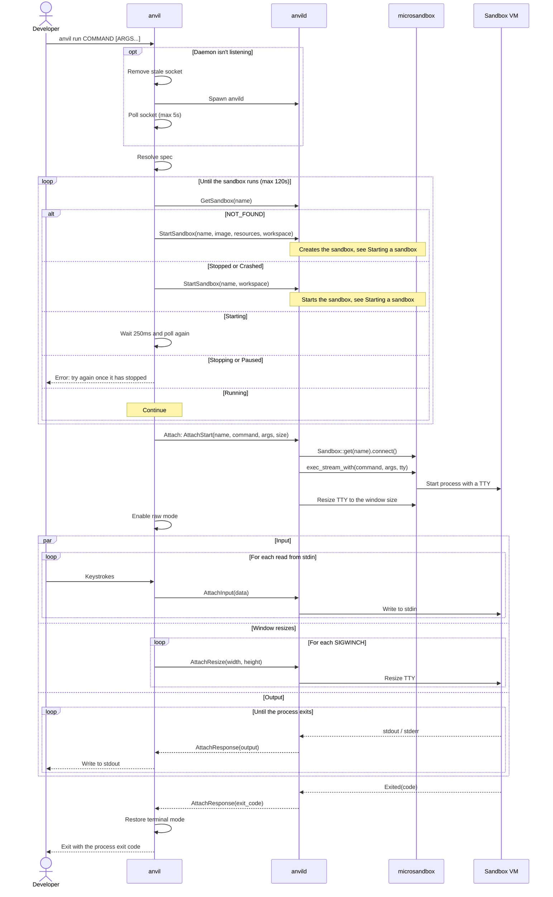
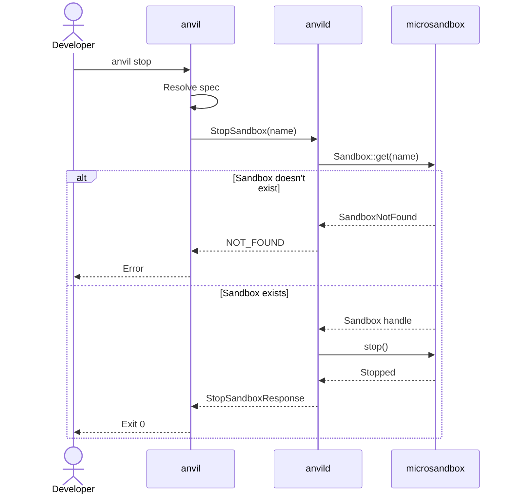
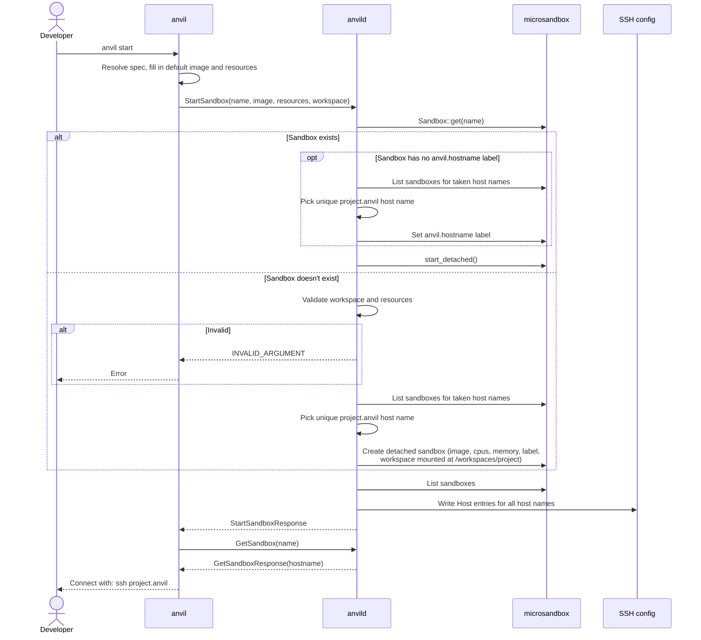
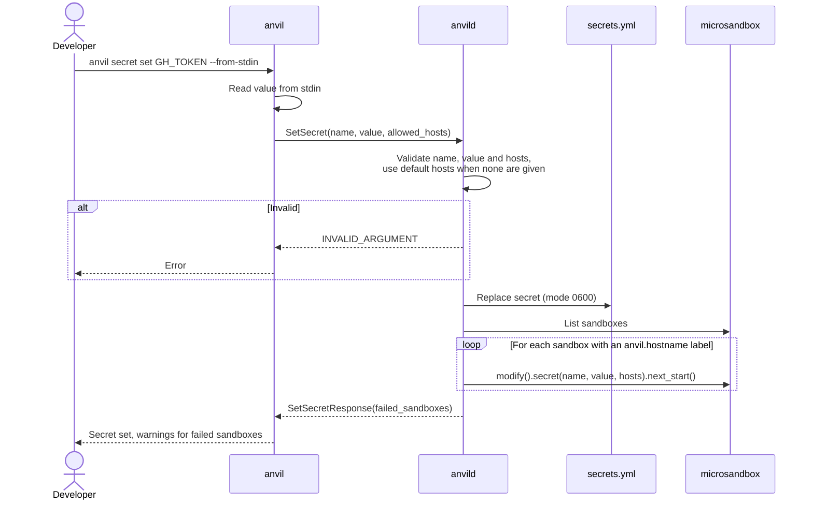
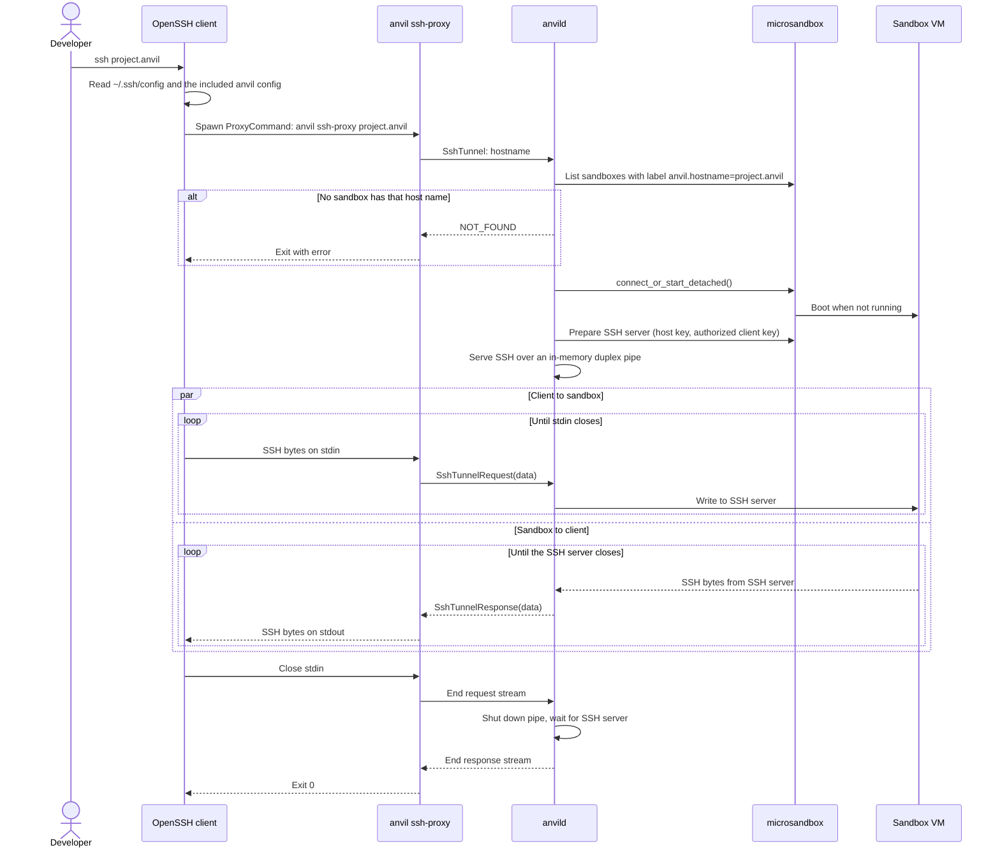

# Runtime view

Every command except `validate` starts by connecting to the daemon over
`$XDG_RUNTIME_DIR/anvild.sock`. When nobody listens on the socket, the CLI
removes a stale socket file, spawns `anvild` and polls the socket for at most
5 seconds. The diagrams below show this step once, in
[Running a session](#running-a-session), and leave it out of the others.

Before `anvild` listens, it exits when the socket already exists, and then
makes sure the microsandbox runtime matches the runtime embedded in its
binary. It extracts the embedded runtime when the runtime is missing or has
another version. When `MSB_PATH` or `paths.msb` selects a runtime with
another version, `anvild` exits instead, and the CLI reports a timeout.

The CLI resolves the sandbox name from `.anvil.yml` in the working directory,
or derives it from the full working directory path when there's no spec file.

## Running a session

`anvil run <command> [args...]` makes sure the sandbox runs, then attaches the
local terminal to a command in the sandbox through the bidirectional `Attach`
stream.

When the CLI disconnects before the process exits, the daemon kills the
process. The sandbox keeps running after the session ends.

## Stopping a sandbox

`anvil stop` stops the sandbox for the working directory. The sandbox and its
disk stay, so it can be started again later.

## Starting a sandbox

`anvil start` creates the sandbox when it doesn't exist yet, or starts the
existing one. The image and resources from the spec only apply when the
sandbox is created.

`anvil run` and SSH connections start a sandbox the same way when it isn't
running, so `anvil start` is optional.

## Setting a secret

`anvil secret set <name> <value>` stores a secret that sandboxes use without
seeing its value. With `--from-stdin`, the CLI reads the value from stdin
instead.

When `anvild` creates a sandbox, it adds all secrets from `secrets.yml`.
microsandbox enables TLS interception for the sandbox and sets each secret's
environment variable to a placeholder such as `$MSB_GH_TOKEN`. Its TLS proxy
replaces the placeholder with the real value in HTTP headers of requests to
the allowed hosts, and blocks requests that carry the placeholder to other
hosts. A running sandbox gets a new or changed secret the next time it
starts.

## Connecting via SSH

`ssh <leaf>.anvil`, `scp` and IDEs reach a sandbox through the SSH config the
daemon generates. It sets `anvil ssh-proxy <host>` as `ProxyCommand`, so the
SSH protocol runs over the `SshTunnel` gRPC stream instead of a network port.
The daemon serves each connection with microsandbox's SSH server over an
in-memory pipe.

The client authenticates with the client key the daemon created, and checks
the sandbox against the host key pinned for `*.anvil` in the `known_hosts`
file. The sandbox keeps running after the connection closes.
